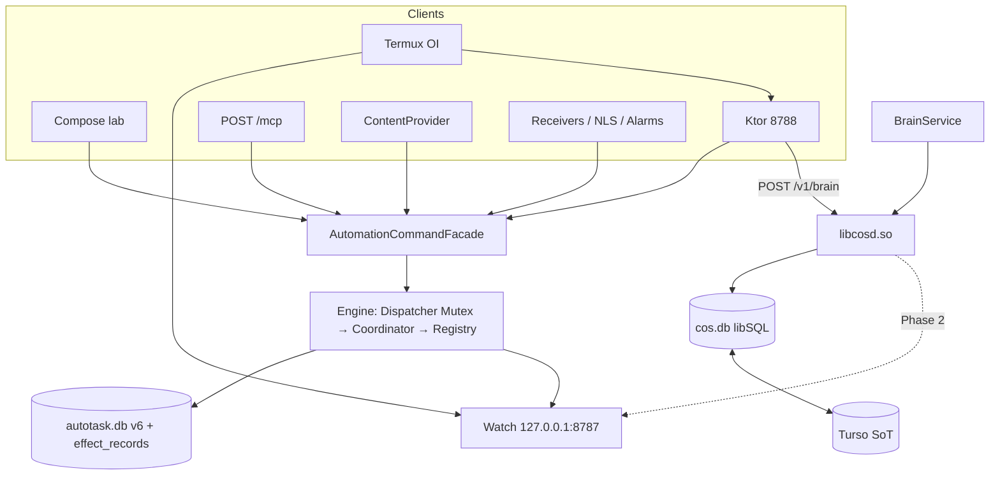
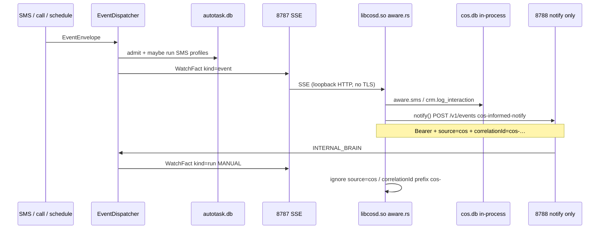

# AutoTask360 2.1.0 → production CoS-on-phone

| Field | Value |
| --- | --- |
| Author | (design / docs pass) |
| Date | 2026-08-18 |
| Status | Draft (rev 4 — operator decisions 2026-08-18) |
| Product | **Adjutant** (face). Runtime spec still titled AutoTask360 2.1.0. `applicationId` `com.aistudio.autotask.svcqx`. |
| Runtime contract | `/Users/hodgeluke/Desktop/Projects/AutoTask-360/spec.md` — **Status: Active**. This document cites it; it does not fork run/step/effect semantics. |
| Executed docs | `/Users/hodgeluke/Desktop/Projects/AutoTask-360/docs/` |

## Overview

AutoTask360 2.1.0 is a working **single-worker durable-run ledger** on Android: one command boundary (`AutomationCommandFacade`), Room `autotask.db` v6 with an effect ledger, globally serialized dispatch, crash-and-resume policy, a loopback command server on 8788, and a reserved watch stream on 8787. The APK also ships `libcosd.so` (Cal-CRM / CoS daemon) under `BrainService`, with `cos.db` as a libSQL embedded replica and Turso as cloud source of truth when `TURSO_URL` / `TURSO_TOKEN` are set.

That architecture is **small but significant**, and it is ahead of the product. The UI is a five-tab lab. The brain does not subscribe to watch. SMS reports `OK` before the radio acknowledges. There is no branded splash, no run timeline, no pairing screen, no widgets, no honest live-status surface.

This design freezes the map, then sequences a production-ready path to **CoS-on-phone**: close the watch→act loop, harden the ledger, and ship an Android-native operator surface (design system, icon, splash, views, widgets, cutout-safe chrome, Ongoing Notification / Live Updates). Dynamic Island is iOS; we do not clone it.

**Do not implement product code in this pass.** Documentation only.

## Background & Motivation

### Current state (verified in tree)

| Fact | Where |
| --- | --- |
| 2.1.0 / versionCode 8 / package `com.aistudio.autotask.svcqx` | `app/build.gradle.kts` |
| Gradle `namespace` still `com.example`; Kotlin packages `com.example.*` | same + `app/src/main/java` |
| Facade is the command boundary | `application/AutomationCommandFacade.kt` |
| Room v6 includes `effect_records` | `data/AutoTaskDatabase.kt` `MIGRATION_5_6` |
| Rust brain `libcosd.so`, sock or 8790, `cos.db` under `files/brain/` | `wa/BrainService.kt` |
| Turso env + `SSL_CERT_FILE` CA bundle | `BrainService.spawnBrain`, `TursoConfig.kt`, `res/raw/cacert.pem` |
| Watch 8787, command 8788 | `server/WatchLoopbackServer.kt`, `KtorServerConfig.kt` |
| Profile search `GET /v1/profiles?q=` | `domain/ProfileSearch.kt`, `KtorLoopbackServer` |
| Principals `INTERNAL_BRAIN` / `LOCAL_DEVICE` privileged; `PAIRED_CLIENT` gated | `security/AccessModels.kt`, `AccessGuard.kt`, `HighRiskPolicy.kt` |
| Remotes AutoTask-360.git + Sapphire-Blu.git at `0d3f513` | `git remote -v`, `git log` |
| G63 serial historically `1010018024018888` | `dev/AGENT_HARNESS_MCP.md` |
| UI: POLICIES / CATALOGUE / LOGS / EVENTS / STATUS | `ui/AutoTaskMainScreen.kt` |
| Onboarding scaffold, no screens | `onboarding/CapabilityOnboarding.kt` |
| SMS sent-intents null | `engine/actions/handlers/CommunicationHandlers.kt` |
| Brain has **no** 8787 client | `agent-cal-crm/src` (no watch/8787 matches) |
| Single module `:app` | `settings.gradle.kts` |

`spec.md` PR 1–7 are implemented at source level. Remaining holes are honesty (SMS completion), loop closure (brain as watch subscriber), and **product**.

### Pain points

1. **The CoS cannot see.** OI in Termux tails 8787; `libcosd.so` does not. Situational actuation is still “someone curls 8788.”
2. **The operator cannot see.** Durable runs exist (`GET /v1/runs/{id}`) but the UI shows `execution_logs` and a REST tester. `INDETERMINATE` is not a first-class screen.
3. **SMS `OK` is a lie** until a sent-intent (or timeout) exists. The effect ledger prevents *double* send on resume; it does not wait for the modem.
4. **Identity is leftover Studio.** `Theme.MyApplication`, `HighDensity*` iOS-green/red, server-rack icon, “Tool Server Heartbeat.”
5. **Port 8787 is a single point of failure** and collides with Headroom/SmartCrusher’s default proxy (not in this tree; known operational hazard).
6. **Face vs package.** User-facing name is **Adjutant**. Runtime/`spec.md`/package remain AutoTask360 / `com.aistudio.autotask.svcqx`. Sapphire-Blu is historical (identical at `0d3f513`) and will be decommissioned.

### Why slow down

Further Kotlin without a map will fork `spec.md`, share a SQLite file “for debug,” or ship a chat wrapper. The operator asked for documentation, an architecture diagram, and a production roadmap with UI/UX fully flushed out. That is this document plus `docs/`.

## Goals & Non-Goals

### Goals

- Document 2.1.0 **as it exists** (processes, ports, trust, persistence, repo topology).
- Specify the **closed CoS loop**: brain subscribes to 8787, acts on 8788 / existing RPC; `cos.db` memory stays off the Room ledger.
- Specify a **production UI/UX**: IA, every view, empty/error/permission states, operator vs CoS surfaces, widgets, live status.
- Specify a **branded design system** and a brand that survives a later rename.
- Sequence Phases 0–6 with exit criteria, risks, and independently reviewable PRs inside `app` packages.
- Keep `spec.md` the only runtime SoT.

### Non-goals

- Implementing Kotlin, changing Gradle versions, or shipping an APK in this pass.
- Extracting `:autotask-*` Gradle modules now (`spec.md` §5 is a later extraction).
- Sharing a SQLite file between Room and Rust.
- Making Mac CoS (`chief-of-staff/`, harness) part of the Android architecture.
- Building Temporal/K8s/a general workflow platform. Temporal is a **product-shape analogy only**.
- Replacing Android permission / FGS / alarm rules.
- Cloning Dynamic Island.
- Silently renaming the product or `applicationId`.
- Forking run/step/effect semantics into these docs.

## Key Decisions

| ID | Decision | Rationale |
| --- | --- | --- |
| KD-1 | `spec.md` remains the runtime contract. New docs cite, they do not restate as law. | Avoid a second SoT for `effectId`, resume, retry, principals. |
| KD-2 | Stay in `app` packages (`com.example.*`) for Phases 1–6 unless a dedicated extraction PR is justified. | Contracts just stabilized. Module extraction is a rename bomb (`namespace` vs `applicationId` already diverge). |
| KD-3 | Persistence stays split: Room `autotask.db` v6 vs Rust `cos.db` / Turso. Never one file. | Two writers, two migration systems, two crash domains. PR2 already paid this cost. |
| KD-4 | Close the CoS loop as **watch client + command client**, not DB sharing and not brain binding 8787. | Matches `spec.md` §1. Brain is privileged (`INTERNAL_BRAIN`) but still a client. |
| KD-5 | Human approval stays a facility for `PAIRED_CLIENT` and opted-in definitions. CoS on-device is not gated per action. | Product is anticipatory staff, not a permission-begging agent. Android permissions + capability policy still apply. |
| KD-6 | UI is first-class (Phases 3–5), Android-native, not a chat wrapper. | CoS product = situation + actuation + visibility. |
| KD-7 | Dark-first; **amber-on-ink** accent; mark without letters; `brand_name` = **Adjutant**. | Operator 2026-08-18. Steel-cyan rejected. |
| KD-8 | “Dynamic Island / notch” maps to **cutout insets + Ongoing Notification + optional Android 16 Live Updates**. No overlay in the punch-hole. | Honesty on Android 12–16. G63 is not an iPhone. |
| KD-9 | 8787 stays watch. **Headroom will leave 8787** (operator-confirmed). | Termux `watch.sh`, schema catalog, `spec.md` pin 8787. Watch does not move. |
| KD-10 | Face name is **Adjutant**. AutoTask360 is historical / runtime / package. **No** `applicationId` or Kotlin-package rename. Scheme stays `autotask://`. Sequence / Antikythera / Castellan rejected. | Operator 2026-08-18. Install id stays `com.aistudio.autotask.svcqx`. `spec.md` may keep the AutoTask360 title until a later runtime PR. |
| KD-11 | SMS completion is a **WAIT-like park**, not an in-`execute()` wait and not a `StepRetryPolicy` retry. See Proposed Design §3.1. | Waiting inside `execute()` holds the global dispatch mutex and can triple-send on OEM-missing sent-intents. Operator `retryRun` after radio timeout is a new `effectId`. |
| KD-12 | Widgets may arm profiles; they may not send SMS. | High-risk side effects stay on an inspectable surface. Operator left Q8 at this default. |
| KD-13 | **Only remote:** `origin` AutoTask-360.git. Sapphire-Blu is historical (identical at `0d3f513`) and **to be deleted**. This pass does not delete the GitHub repo. | Operator 2026-08-18. Do not fast-forward `sapphire-blu`. Brain source remains `agent-cal-crm` → `libcosd.so`. |
| KD-14 | Persist `principalKind` + `principalId` on `automation_runs` at admission from `CommandContext` (Room **v7** + `spec.md`). Infer-first is rejected. | Today’s run row has no `source` / principal. Inferring from `correlationId` or `"api"` paints CoS and receivers as the operator. Home chips require a truthful column **before** PRs 4.2/4.3. |
| KD-15 | Policy stubs (`PolicyStubActionHandler`) return `SKIPPED` / `not_implemented` if invoked. Schema `delivery-ready` is not enough. | Handler currently returns `OK` / “dispatched (system policy level)” with no side effect. |
| KD-16 | v1 CoS product is **sideload only**. Phase 6.2 Play listing / Data safety is **deferred**, not in v1. | Operator 2026-08-18. Signing (6.1) and G63 smoke (6.4) still apply. |
| KD-17 | Parameterize CRM owner as **`COS_OWNER`** before Phase 2.2 `aware.sms` memory. Do **not** ship `"derrick"` as the 2.2 default. | Operator 2026-08-18. Seed / MCP examples / `libsql_store` / `aware.*` read the env. Empty `COS_OWNER` is fail-visible. |

## Proposed Design

### 1. Architecture today

See executed doc [`docs/architecture/OVERVIEW.md`](/Users/hodgeluke/Desktop/Projects/AutoTask-360/docs/architecture/OVERVIEW.md). Summary diagram:



Trust principals and ports are tabulated in OVERVIEW. Command travel is sequenced in [`docs/architecture/CODEBASE.md`](/Users/hodgeluke/Desktop/Projects/AutoTask-360/docs/architecture/CODEBASE.md).

### 2. Target: closed CoS loop (Phase 2 mini-spec)

The brain is a **client** of watch 8787. **2.2 uses `aware.sms` / `aware.call` as shipped** in `agent-cal-crm/src/bin/aware.rs`. Memory is in-process (`rpc::dispatch` → `crm.log_interaction` on `cos.db`). The only 8788 hairpin already in that file is `notify()` → `POST /v1/events` `cos-informed-notify`. There is no inverse `BrainClient` RPC and no new `requestRun` of the original SMS profile. Full table: [`docs/product/ROADMAP.md`](/Users/hodgeluke/Desktop/Projects/AutoTask-360/docs/product/ROADMAP.md) Phase 2.



**Transport.** `aware.rs` already has a hand-rolled loopback HTTP client on **`AUTOTASK_URL`** (default `http://127.0.0.1:8788`). Watch subscribe is a **small loopback GET/SSE parser** (~50–100 lines, `tokio::net::TcpStream`). Do not add `reqwest`. Do **not** invent `AUTOTASK_COMMAND_URL` — reuse `AUTOTASK_URL` (an alias that reads the same env is allowed).

| Env / credential | Value |
| --- | --- |
| `AUTOTASK_WATCH_URL` | default `http://127.0.0.1:8787/v1/watch/stream` |
| `AUTOTASK_URL` | default `http://127.0.0.1:8788` — **existing** name in `aware.rs` |
| `COS_OWNER` | **Required** (KD-17). CRM / `aware.*` owner id. Empty → fail spawn/seed. Do not default to `"derrick"`. |
| Bearer | `cos serve --token` = `BrainService.getToken()` |

Watch 8787 is loopback-only and **unauthenticated** today. Command 8788 on a release build **requires** a bearer (`DEBUG_LOOPBACK` is debug-only). Shipped `notify()` / `autotask_post` send **no** `Authorization` header — that 401s in release. Phase 2 deltas on the **existing** `notify()` path (same PRs as the subscriber):

1. `Authorization: Bearer <cos-token>`
2. `source=cos`
3. `correlationId=cos-<uuid>`
4. Do not log the bearer

**Reconnect:** 2 s → 60 s cap. On connect: `GET /v1/watch?limit=50` then SSE.

**Catch-up honesty (2.2):** facts missed while `libcosd.so` was dead are **acceptable**. Device smoke: brain down during SMS → no duplicate send; CRM interaction **may be absent**.

**Ignore own facts:** `notify()` traffic must set `source=cos` and `correlationId=cos-<uuid>`. Subscriber drops matching facts. 2.2 still no-ops unknown `MANUAL` types besides not re-entering `aware.sms` on its own notify run.

**WatchFact → action (2.2) — call shipped methods:**

| Fact | Action |
| --- | --- |
| `kind=event`, `SMS` | **`aware.sms` as shipped** with `owner` = `COS_OWNER`: in-process CRM log + `notify()` → `cos-informed-notify`. **Do not** auto-fire the original inbound SMS profile again. **Never** `retryRun`. |
| `kind=event`, `INCOMING_CALL` | `aware.call` as shipped (also `notify()`). |
| `kind=event`, other / `event.deduped` | no-op |
| `kind=run` (incl. the notify MANUAL) | ignore if `source=cos`; else optional extra `crm.log_interaction`. **Never** `retryRun`. |

`notify()` is **allowed** in 2.2. It is not a new `requestRun` API. It is the existing informed-notification profile. Anticipatory allow-listed `requestRun` stays later.

### 3. Runtime hardening

#### 3.1 SMS sent-intent — WAIT-like park (normative)

Today `SendSmsActionHandler` calls `SmsManager.sendTextMessage(..., sentIntent=null, deliveryIntent=null)` and returns `OK` immediately. `EventDispatcher.dispatch` holds `mutex.withLock` around `coordinator.execute`. `RunCoordinator` wraps the runner in `withTimeout(DEFAULT_STEP_TIMEOUT_MS = 30_000)` and retries retryable `FAILED` up to 3× with 100–400 ms backoff. `ActionExecutor` applies a second 30 s `handler.timeoutMs`. Waiting inside `execute()` would stall **global dispatch** and can **re-send** on OEM-missing broadcasts (ledger empty → same `effectId` re-enters `sendTextMessage`).

**Chosen model: park like `WAIT`, status `WAITING`, continuation `kind=sms_sent`.** Duration-WAIT and SMS-park **must not share a completion path.**

Today `RunCoordinator.execute` on any `WAITING` with `wakeAt <= now` calls `completeWaitStep` → step **`OK`** (`RunCoordinator.kt` 82–98, 313–323). `recoverIncomplete` and `RunWakeWorker` → `resumeRun` use that branch. If SMS park reused it, a missing sent-intent would become delayed `OK` — the original lie.

**`continuationJson.kind` is mandatory on new parks.** Missing `kind` (2.1.0 duration-WAIT rows: `{durationMs, wakeAt}`) is treated as duration wait.

| `kind` | Deadline / `RunWakeWorker` / `recoverIncomplete` after `deadlineAt` | `RESULT_OK` sent-intent | Recover with `deadlineAt` in the future |
| --- | --- | --- | --- |
| absent / `wait` | `completeWaitStep` → step `OK`, continue | n/a | reschedule wake only |
| `sms_sent` | **`completeStep(..., FAILED, sms_radio_timeout)` only.** **Must not** call `completeWaitStep`. | `completeStep(..., OK)` + **effect ledger commit** + **`WakeScheduler.cancel`** | re-register non-exported `SmsSentReceiver` **and** reschedule wake; **do not** `sendTextMessage` |

1. Coordinator intercepts `SEND_SMS`: handler runs **once**, then `execute()` returns (mutex released).
2. Handler validates number/text, registers **non-exported** `SmsSentReceiver`, `sendTextMessage(..., sentPI, null)` (**sent-only**), returns `WAITING` / `sms_pending_sent`. No sleep.
3. Persist step `WAITING` with:

```json
{ "kind": "sms_sent", "effectId": "…", "runId": "…", "stepIndex": 0, "deadlineAt": 1710000020000 }
```

   Set `run.wakeAt = deadlineAt`. Schedule `WakeScheduler` at that instant. New duration `WAIT` rows should write `"kind":"wait"` going forward.
4. `SMS_SENT_TIMEOUT_MS = 20_000`, independent of `DEFAULT_STEP_TIMEOUT_MS` / `handler.timeoutMs`.
5. `SmsSentReceiver` extras: `runId`, `stepIndex`, `effectId`. `exported=false`. `RESULT_OK` → `completeStep(OK)` as in the table. Sent-intent error → `completeStep(FAILED, sms_send_failed)` + cancel wake. Not `StepRetryPolicy`-retryable. **Never** `sendTextMessage` again on this `effectId`.
6. `execute` / `recoverIncomplete` / `RunWakeWorker` **must read `continuationJson.kind` before** the existing `completeWaitStep` branch. `kind=sms_sent` + past deadline → `FAILED` `sms_radio_timeout` only.
7. Operator `retryRun` after radio failure is a **new run / new `effectId`**.
8. Emulator / test flag: non-throwing `sendTextMessage` may `OK` immediately (documented in the 1.3 `spec.md` delta). Production always parks.
9. Second event must dispatch while SMS is parked. Test required.

Run-detail copy (UI_UX §6.6): duration WAIT = “will continue automatically”; `kind=sms_sent` = “waiting for radio — fails in Ns” (countdown from `deadlineAt`).

**`spec.md` delta in PR 1.3** (describe now; **do not edit `spec.md` in this docs pass**):

- §6.3: `SEND_SMS` `OK` means the sent-intent fired (or the documented emulator fallback), not “`SmsManager` accepted the enqueue.”
- `SEND_SMS` may park as `WAITING` with continuation `kind=sms_sent` until sent-intent or `SMS_SENT_TIMEOUT_MS`.
- `kind=sms_sent` must not use `completeWaitStep` (that marks duration WAIT `OK`). Deadline is `FAILED` `sms_radio_timeout`.
- Radio timeout / send error is not activity-retry; explicit `retryRun` is a new `effectId`.
- Note 2.1.0 still enqueue-as-OK; the clause lands with the implementation PR (target 2.1.x / 2.2).

**Tests (1.3):** timeout does not send a second SMS; crash mid-window still hits the ledger / does not re-send; dispatch of a second event proceeds while SMS is in-flight; emulator fallback documented.

#### 3.2 Other Phase 1 honesty

- **Retry JSON:** only if a test requires per-profile override; else keep `StepRetryPolicy` globals. Radio timeout is **not** that override.
- **Watch:** `onTerminal` already publishes terminal runs including `INDETERMINATE`. `cancelRun` publishes separately (`RunCoordinator.cancel` does not call `onTerminal`). **WAIT wake is not terminal** and is **not** a watch event — `RunWakeWorker` → `resumeRun` → continue; the next `kind=run` is the eventual terminal status. PR 1.1 is the INDETERMINATE JVM test only. Mid-run WAIT visibility (`kind=run.update`) is **out of scope** for 1.1.
- **Stubs:** if `PolicyStubActionHandler` is invoked, return `SKIPPED` / `not_implemented`, not `OK`. Schema remains non-`delivery-ready`.

### 4. UI/UX, design system, brand

Executed, full flush-out:

- [`docs/product/UI_UX.md`](/Users/hodgeluke/Desktop/Projects/AutoTask-360/docs/product/UI_UX.md) — IA, every view, states, widgets, operator vs CoS.
- [`docs/product/DESIGN_SYSTEM.md`](/Users/hodgeluke/Desktop/Projects/AutoTask-360/docs/product/DESIGN_SYSTEM.md) — tokens, motion, a11y, cutouts, Android live surfaces.
- [`docs/product/BRAND.md`](/Users/hodgeluke/Desktop/Projects/AutoTask-360/docs/product/BRAND.md) — mark, splash (SplashScreen API), chrome, notification/widget identity; rename open.

Home is **situation**, not Policies. Runs replace Logs. Pairing becomes a phone screen. Lab tabs collapse into Diagnostics.

### 5. Widgets and live status

Three Glance widgets (situation, last run, quick-arm). Situation Ongoing Notification **replaces the engine heartbeat copy** (`AutoTaskService` 8788). Brain FGS (8791) stays; WhatsApp (8789) and HealthMonitor (8792) stay. Do not collapse four FGS types into one notification. Optional Android 16 promoted-ongoing / Live Updates if `hasPromotableCharacteristics()` allows — **not** the ship gate. Cutout-safe Compose chrome. **No** punch-hole overlay. Deep links: [`UI_UX.md` §3](/Users/hodgeluke/Desktop/Projects/AutoTask-360/docs/product/UI_UX.md) is SoT (`autotask://profiles/{id}`, `autotask://runs/{runId}`).

### 6. Play / sideload

Signing already specified ([`docs/RELEASE_SIGNING.md`](/Users/hodgeluke/Desktop/Projects/AutoTask-360/docs/RELEASE_SIGNING.md)). Phase 6 is CI secrets, listing copy (blocked on name), accessibility/NLS disclosure, R8 decision, `spec.md` §14 release gates.

## API / Interface Changes

### Unchanged (cite only)

Facade commands in `spec.md` §7. REST/MCP already map. `GET /v1/profiles?q=` / `ProfileListQuery` stay.

### Phase 1 additions (runtime)

| Change | Shape |
| --- | --- |
| SMS park | External JSON unchanged. Step status may be `WAITING` with `continuationJson.kind=sms_sent`. `GET /v1/runs/{id}` already returns `WAITING`. **`spec.md` §6.3 delta in the same PR** (see §3.1). |
| Stubs | `SKIPPED` / `not_implemented` — no schema add. |
| Optional `executionPolicy.retry` | Only if warranted — `{maxAttempts, initialBackoffMs, maxBackoffMs}`. Must land in `spec.md` + codec + validator in the same PR. Not used for radio timeout. |

### Phase 2 additions (brain)

| Change | Shape |
| --- | --- |
| `AUTOTASK_WATCH_URL` | Env. Default `http://127.0.0.1:8787/v1/watch/stream`. |
| `AUTOTASK_URL` | **Existing** `aware.rs` env. Default `http://127.0.0.1:8788`. Do not add `AUTOTASK_COMMAND_URL` except as an alias of this. |
| Bearer + identity on `notify()` | `Authorization: Bearer <cos-token>`, `source=cos`, `correlationId=cos-<uuid>`. |
| Brain watch client | Small loopback GET/SSE parser. `aware.sms` as shipped (in-process CRM + `notify()`). No inverse RPC. |

### Phase 4–5 additions (Android)

| Change | Shape |
| --- | --- |
| Deep links | SoT: [`UI_UX.md` §3](/Users/hodgeluke/Desktop/Projects/AutoTask-360/docs/product/UI_UX.md). `autotask://situation`, `autotask://profiles/{id}`, `autotask://runs/{runId}`, `autotask://trust`, `autotask://diagnostics`. Scheme stays `autotask` unless the operator says otherwise. |
| Glance widgets + `situation_channel` | New components; facade-only writes. |
| **`AutomationRun.principalKind` / `principalId`** | **Required.** Room v7 + `spec.md` in PR **4.0**, before Home/timeline. Copied from `CommandContext` at admission. Optional `GET /v1/runs?status=` for last-N terminal. |

No new public execute verb. No second MCP surface.

## Data Model Changes

### No change in Phase 0

Room v6 and libSQL schema stay.

### Required later

| Phase | Change | Migration |
| --- | --- | --- |
| **4.0 (required, before 4.2)** | `principalKind TEXT NOT NULL`, `principalId TEXT NOT NULL` on `automation_runs`. Defaults for pre-v7 rows: `LOCAL_DEVICE` / `local-device`. Written at admission from `CommandContext`. Receivers → `LOCAL_DEVICE`; UI → `LOCAL_DEVICE`; REST/MCP → authenticated principal (`INTERNAL_BRAIN`, `PAIRED_CLIENT`, …). | Room **v7** + `spec.md` run snapshot JSON |
| 1 (optional) | `executionPolicy` retry fields in profile JSON | None (JSON column); compiler/validator only |
| 2 | More `interactions` rows in `cos.db` | Already have the table |

Optional query: `GET /v1/runs?status=SUCCESS,PARTIAL,FAILED,CANCELLED,SKIPPED,INDETERMINATE&limit=5` so Home “last 5 terminal” is not `listRuns(limit=5)` of mixed in-flight rows. If the facade can filter in-process first, a query param is still the honest API.

Retention unchanged: 14 days / 500 logs; incomplete runs never pruned (`RetentionLimits` in `spec.md`).

**Never:** merge DBs, write runs into Turso, open `autotask.db` from Rust.

## Alternatives Considered

### A. Chat-wrapper home (Open Interpreter as the UI)

- **Pros:** Fast to demo; OI already on 8787.
- **Cons:** Product becomes a terminal. No run timeline, no pairing, no widgets, no Play story. Violates `spec.md` §1 (“not a chat wrapper”).
- **Reject.** OI stays a Termux subscriber.

### B. Extract Gradle modules now (`:autotask-domain` …)

- **Pros:** Matches `spec.md` §5 target packages.
- **Cons:** `namespace com.example` vs `applicationId` already split; extraction is a 100-file move with no behavior change; blocks UI/loop work.
- **Defer** until after Phase 4, as `spec.md` already allows.

### C. One SQLite file “with attached schemas”

- **Pros:** Single backup, simpler mental model.
- **Cons:** Room + libSQL WAL, Turso replica adoption, two languages, W^X spawn. Explicitly forbidden (`spec.md` §3, KD-3).
- **Reject.**

### D. Brain polls Room / ContentProvider

- **Pros:** No SSE.
- **Cons:** Couples processes, invites schema leak, fights “they do not poll Room.”
- **Reject.** Watch is the bus.

### E. iOS-like Dynamic Island overlay

- **Pros:** Matches the casual request language.
- **Cons:** Fights OEM cutouts, fails TalkBack, not an Android API.
- **Reject.** Map to Ongoing Notification + optional Live Updates (KD-8).

### F. Rename `applicationId` / Kotlin packages to Adjutant

- **Pros:** Face and store id match.
- **Cons:** Breaks updates for `com.aistudio.autotask.svcqx`; huge `com.example` move.
- **Reject.** Face name is Adjutant via `brand_name` (KD-10). Package stays.

### G. Infer principal from `source` / `correlationId` (no Room v7)

- **Pros:** Avoids a schema bump before UI.
- **Cons:** `automation_runs` does not store `source`. Receivers hardcode `source=internal`; REST defaults `source=api`; `correlationId` defaults to `eventId`. CoS MANUAL and human FIRE are indistinguishable. Chips would lie.
- **Reject.** KD-14: persist at admission.

### H. SMS: wait inside `execute()` / keep step `RUNNING` until sent-intent

- **Pros:** No new continuation kind.
- **Cons:** Holds `EventDispatcher` mutex for up to ~30 s × 3; `StepRetryPolicy` re-enters `sendTextMessage` when the OEM omits the broadcast; second events stall.
- **Reject.** KD-11: WAIT-like park, radio timeout not retryable.

### I. Brain polls `GET /v1/watch` instead of SSE

- **Pros:** Even smaller client (no EventSource parse).
- **Cons:** Latency and battery; still cannot recover more than the 100-fact ring. SSE is the existing contract Termux already uses.
- **Reject for the live path.** Poll is only the reconnect catch-up (`?limit=50`).

### J. Situation Live Update as the primary live surface

- **Pros:** Matches “status chip” language.
- **Cons:** API 36 promoted-ongoing is for **user-initiated** `Notification.ProgressStyle` journeys; a CoS “next fire / brain halted” chip may fail `hasPromotableCharacteristics()`.
- **Reject as gate.** KD-8: ongoing notification ships; Live Update is optional.

## Security & Privacy Considerations

Threat model is unchanged from `spec.md` §10 and [`docs/LAN_SECURITY.md`](/Users/hodgeluke/Desktop/Projects/AutoTask-360/docs/LAN_SECURITY.md).

| Threat | Mitigation |
| --- | --- |
| Unauthenticated LAN | Default bind `127.0.0.1`; LAN only after pairing + explicit enable |
| `cos-` token on LAN | `AccessGuard` → `INTERNAL_TOKEN_ON_LAN` |
| Paired remote high-risk | `approvedActions` or `403 APPROVAL_REQUIRED` |
| Token theft (`atc-`) | Store SHA-256 only (`PairingManager`) |
| Token theft (Turso) | EncryptedSharedPreferences (`TursoConfig`) |
| Token theft (`cos-`) | **Plaintext** today in `brain_config` SharedPreferences (`BrainService.getToken`). `allowBackup=false` limits backup exfil; on-device dumps remain in scope. Phase 2 must not log the bearer. Optional later: move `brain_token` into the same EncryptedSharedPreferences as Turso. |
| Backup exfil | `allowBackup=false` |
| Log leak | `Redaction`; UI must not show SMS bodies / tokens / screen dumps |
| Brain as confused deputy | Watch client ignores own `correlationId`; still cannot open Room |
| Accessibility / NLS | Disclose in onboarding + Play; exported only as platform-required |
| Headroom on 8787 | Fail visible; do not fall back to opening DBs |
| Widget SMS | Forbidden (KD-12) |

UI pairing screen is `LOCAL_DEVICE` only. Completing pairing on-device must not display an `atc-` token in a screenshotable snackbar if we ever add that path — prefer remote-complete as today.

Cleartext remains denied except localhost (`network_security_config.xml`).

## Observability

Today: `/v1/status` (version, ktor, watch flag), `BrainService.statusJson`, watch buffer size, FGS text.

Target (incremental):

| Signal | Consumer | Phase |
| --- | --- | --- |
| `watch_running`, buffered, last fact age | Diagnostics, Home banner | exists / 4 |
| Brain `halted`, `restart_count`, last_error | Home, Diagnostics | exists / 4 |
| Incomplete event count, oldest age | `/v1/status`, Diagnostics | 1 |
| 24h `FAILED` / `INDETERMINATE` counts | Diagnostics | 4 |
| Scheduler drift | Schedule screen | 4 |
| Turso last sync ok/err | Diagnostics (no URL dump) | 2 |
| Situation notification | Operator | 5 |

Alerting is on-device (banners + ongoing notification), not a cloud APM. Do not add Firebase Analytics as a prerequisite.

## Rollout Plan

### Feature flags

One owner: `com.example.application.FeatureFlags` (still in `app`). Typed getters/setters over SharedPreferences `autotask_feature_flags`. PR **4.1** introduces the helper (or a tiny 1.x if Phase 2 needs `brain.watch` first — then 2.2 adds the object and 4.1 reuses it). Do not scatter `getBoolean`.

| Key | Default | Meaning | How to flip |
| --- | --- | --- | --- |
| `ui.prod` | `false` until 4.7 | Navigation-Compose IA vs lab tabs | Diagnostics toggle (`LOCAL_DEVICE` only) |
| `ui.diagnostics.advanced` | `false` | REST tester / event simulator | same |
| `brain.watch` | `false` | `BrainService` exports `AUTOTASK_WATCH_URL` and the new `libcosd.so` subscribes | Diagnostics, after the `.so` drop is verified |

Verification for `brain.watch`: on-device, brain log line `watch subscribed` (no bearer) and `/v1/status` brain not `halted`. Operator (or author via Diagnostics) then sets the flag. No automatic enable.

`adb` fallback: `run-as com.aistudio.autotask.svcqx` + prefs, or the Diagnostics toggle. No exported debug receiver.

### Staging

1. Sideload on G63 (`1010018024018888` historically) after **each sideloadable merge**. **`versionCode` increments on every such drop** (`docs/RELEASE_SIGNING.md`). `versionName` 2.1.x = Phase 1, 2.2.0 = Phase 2, 2.3.x = Phase 3–4 (multiple bumps).
2. Phase 2: `brain.watch` on one device overnight (SMS + schedule). Expect: inbound SMS → `aware.sms`; brain-down SMS → no duplicate send, interaction may be missing.
3. Phase 4: `ui.prod` for author; lab remains reachable via Diagnostics.
4. Phase 6: **sideload** signed APKs (KD-16). No Play internal track in v1. **CI signing (6.1) may start on day one** in parallel with Phase 3.

Rollback:

- `ui.prod=false` restores lab tabs (keep `AutoTaskMainScreen` until 4.8).
- `brain.watch=false` + previous `libcosd.so` (APK revert).
- Room v7 is forward-only once 4.0 ships; it ships **before** Home, not after infer fails.
- Signing/keystore rollback is **not** a thing — do not rotate casually ([`docs/RELEASE_SIGNING.md`](/Users/hodgeluke/Desktop/Projects/AutoTask-360/docs/RELEASE_SIGNING.md)).

## Open Questions

For the operator. Also listed in [`docs/product/BRAND.md`](/Users/hodgeluke/Desktop/Projects/AutoTask-360/docs/product/BRAND.md) and the roadmap.

1. ~~Product name~~ **Decided (KD-10):** **Adjutant**. AutoTask360 = runtime/package. Castellan / Sequence / Antikythera rejected.
2. ~~Accent~~ **Decided (KD-7):** amber-on-ink. Steel-cyan rejected.
3. ~~Deep-link scheme~~ **Decided:** keep `autotask://` (stable; no Play identity change).
4. ~~`applicationId`~~ **Decided:** never change in this product line (`com.aistudio.autotask.svcqx`).
5. ~~CRM owner `"derrick"`~~ **Decided (KD-17):** parameterize `COS_OWNER` before 2.2. Empty is fail-visible.
6. **Android 16 Live Updates** availability on the G63 / OEM skin — verify before writing chip code.
7. ~~Headroom/SmartCrusher port~~ **Decided (KD-9):** Headroom **will leave 8787**. Watch stays.
8. ~~Widget run-now for high-risk~~ **Decided (KD-12):** no.
9. **Persist `StepRetryPolicy` per profile?** Default no until a failing scenario appears. Radio timeout is not this.
10. ~~Principal on `automation_runs`~~ **Decided (KD-14):** persist Room v7 before Home.
11. **R8 / minify** in release (`isMinifyEnabled = false` today).
12. ~~Play vs sideload~~ **Decided (KD-16):** sideload only for v1. Play listing deferred.
13. ~~Push remote~~ **Decided (KD-13):** `origin` AutoTask-360.git only. Decommission Sapphire-Blu (operator deletes the GitHub repo; this pass is docs only). Remove local `sapphire-blu` remote when the operator does it.
14. **Whether `libcosd.so` in `jniLibs` matches current `agent-cal-crm` HEAD** (not verified byte-for-byte in this pass).
15. ~~`COS_OWNER`~~ **Decided:** same as Q5 / KD-17.

## References

- [`spec.md`](/Users/hodgeluke/Desktop/Projects/AutoTask-360/spec.md) — Active runtime specification, AutoTask360 2.1.0
- [`docs/README.md`](/Users/hodgeluke/Desktop/Projects/AutoTask-360/docs/README.md) — index
- [`docs/architecture/OVERVIEW.md`](/Users/hodgeluke/Desktop/Projects/AutoTask-360/docs/architecture/OVERVIEW.md)
- [`docs/architecture/CODEBASE.md`](/Users/hodgeluke/Desktop/Projects/AutoTask-360/docs/architecture/CODEBASE.md)
- [`docs/architecture/DATA.md`](/Users/hodgeluke/Desktop/Projects/AutoTask-360/docs/architecture/DATA.md)
- [`docs/architecture/REPOS.md`](/Users/hodgeluke/Desktop/Projects/AutoTask-360/docs/architecture/REPOS.md)
- [`docs/product/ROADMAP.md`](/Users/hodgeluke/Desktop/Projects/AutoTask-360/docs/product/ROADMAP.md)
- [`docs/product/UI_UX.md`](/Users/hodgeluke/Desktop/Projects/AutoTask-360/docs/product/UI_UX.md)
- [`docs/product/DESIGN_SYSTEM.md`](/Users/hodgeluke/Desktop/Projects/AutoTask-360/docs/product/DESIGN_SYSTEM.md)
- [`docs/product/BRAND.md`](/Users/hodgeluke/Desktop/Projects/AutoTask-360/docs/product/BRAND.md)
- [`docs/LAN_SECURITY.md`](/Users/hodgeluke/Desktop/Projects/AutoTask-360/docs/LAN_SECURITY.md)
- [`docs/RELEASE_SIGNING.md`](/Users/hodgeluke/Desktop/Projects/AutoTask-360/docs/RELEASE_SIGNING.md)
- [`docs/BACKUP_REDACTION_POLICY.md`](/Users/hodgeluke/Desktop/Projects/AutoTask-360/docs/BACKUP_REDACTION_POLICY.md)
- [`docs/TROUBLESHOOTING.md`](/Users/hodgeluke/Desktop/Projects/AutoTask-360/docs/TROUBLESHOOTING.md) — slightly stale on `SEND_SMS` resume; `spec.md` §6.3 wins
- [`dev/AGENT_HARNESS_MCP.md`](/Users/hodgeluke/Desktop/Projects/AutoTask-360/dev/AGENT_HARNESS_MCP.md)
- `agent-cal-crm/docs/ARCHITECTURE.md` — team overview; `spec.md` wins on conflicts
- `agent-cal-crm/src/bin/cos.rs`, `src/store/libsql_store.rs`

## PR Plan

Independently reviewable PRs. Stay in `app` packages (and `agent-cal-crm` where noted). Each PR: buildable, tests for the gate, `spec.md` updated **only** if semantics change.

### Phase 0 — documentation (this pass; not a code PR)

| # | Title | Files / components | Deps | Description |
| --- | --- | --- | --- | --- |
| 0.1 | docs: architecture + product freeze | `docs/**` (no Kotlin) | — | Index, OVERVIEW, CODEBASE, DATA, REPOS, ROADMAP, UI_UX, DESIGN_SYSTEM, BRAND. Done in this work. |

### Phase 1 — runtime hardening

| # | Title | Files / components | Deps | Description |
| --- | --- | --- | --- | --- |
| 1.1 | test: watch publishes INDETERMINATE | `WatchPublisher`, coordinator/watch tests | — | (a) JVM: fail-closed resume emits `kind=run` `INDETERMINATE`. WAIT wake is **not** a watch event — document in the test comment, do not emit `run.update`. |
| 1.2 | docs: fix TROUBLESHOOTING SEND_SMS resume | `docs/TROUBLESHOOTING.md` only | — | Align ops doc with 2.1.0 ledger (dedupe-capable). |
| 1.3 | feat: SMS sent-intent WAIT-like park | `CommunicationHandlers.kt`, non-exported `SmsSentReceiver`, `RunCoordinator.execute` / `recoverIncomplete` / `RunWakeWorker` **kind branch**, `completeStep`, `WakeScheduler` cancel, **`spec.md` §6.3**, instrumentation | 1.1 | Contract in §3.1. `kind=sms_sent` **must not** `completeWaitStep`. Deadline → `FAILED` `sms_radio_timeout`. `RESULT_OK` → `OK` + ledger + cancel wake. Recover future deadline: re-register receiver + reschedule; no second send. |
| 1.4 | feat: stubs return SKIPPED | `PolicyStubActionHandler`, registry tests | — | `not_implemented`. Can land parallel to 1.3. |
| 1.5 | (optional) feat: per-profile retry JSON | `domain` codec/validator, `spec.md`, tests | 1.3 | Only if a non-radio scenario needs it. |

### Phase 2 — CoS loop

| # | Title | Files / components | Deps | Description |
| --- | --- | --- | --- | --- |
| 2.0 | feat(cos): `COS_OWNER` env | `BrainService` injects `COS_OWNER`; `cos seed` / `libsql_store` / `aware.*` / MCP examples **must not** default to `"derrick"`; empty env fails spawn/seed visibly | before 2.3 | Prerequisite for `aware.sms` memory. |
| 2.1 | feat(cos): loopback watch GET/SSE client | `agent-cal-crm` small parser; reconnect 2s–60s; `GET /v1/watch?limit=50` then SSE; ignore `source=cos` / `correlationId` prefix `cos-` | 1.1 | No `reqwest`. No Room. Missed facts while dead are acceptable. |
| 2.2 | feat: env + FeatureFlags `brain.watch` | `BrainService` passes **`AUTOTASK_URL`** + `AUTOTASK_WATCH_URL` + `COS_OWNER` + token; `FeatureFlags`; tests | 2.0, 2.1 | Default flag off. `lastError` if 8787 down or `COS_OWNER` empty. Do not log bearer. New `libcosd.so` drop. |
| 2.3 | feat(cos): subscribe + shipped `aware.sms` | WatchFact → `aware.sms` / `aware.call` as shipped (`owner` = `COS_OWNER`); patch `notify()` with Bearer + `source=cos` + `correlationId=cos-…`; **never** `retryRun`; do not re-fire the inbound SMS profile | 2.2 | Memory in-process. `notify()` allowed. Smoke: SMS → CRM + notify; brain-down SMS → no duplicate send. |

### Phase 3 — brand + design system

| # | Title | Files / components | Deps | Description |
| --- | --- | --- | --- | --- |
| 3.1 | feat(ui): Brand tokens + BrandTheme (dark-first, **amber-on-ink**) | `ui/theme/*`; `brand_name` = **Adjutant**; `app_name` string; delete unused `colors.xml` leftovers | — | 12 sp labels. No `applicationId` change. Contrast check. Bump `versionCode`. |
| 3.2 | feat(ui): adaptive icon + monochrome + ic_stat_brand | `res/drawable`, `res/mipmap*` | 3.1 | Mark without letters (`BRAND.md` §4). Wordmark Adjutant, not AutoTask. Bump `versionCode`. |
| 3.3 | feat(ui): SplashScreen API | `themes.xml`, `MainActivity`, `core-splashscreen`, `AutoTaskRuntime.runtimeReady` | 3.2 | Min 400 ms, cap 1200 ms, `runtimeReady`. Bump `versionCode`. |
| 3.4 | feat(ui): branded FGS copy | `AutoTaskService` (8788) | 3.2 | Titles use **Adjutant**, not “Tool Server Heartbeat”. Do not merge WA/health/brain services. |

### Phase 4 — production Compose surfaces

| # | Title | Files / components | Deps | Description |
| --- | --- | --- | --- | --- |
| 4.0 | feat(data): persist principal on runs | Room **v7** `principalKind`/`principalId`, `spec.md`, facade `listRuns` + optional `?status=`, tests | — | Admission from `CommandContext`. **Before** 4.2/4.3. |
| 4.1 | feat(ui): Navigation-Compose + `FeatureFlags` | `MainActivity`, `ui/nav`, `FeatureFlags`, keep `AutoTaskMainScreen` | 3.1 | Flag off = lab. Diagnostics toggles `LOCAL_DEVICE`. |
| 4.2 | feat(ui): Home / situation | `ui/situation/*` | **4.0, 4.1** | Next fire, in-flight, **last 5 terminal** (`status in` terminal set), truthful `PrincipalChip`. Roborazzi. |
| 4.3 | feat(ui): Run timeline + run detail | `ui/runs/*` | **4.0, 4.1** | Filter by persisted principal. `effectId`, resume class, `INDETERMINATE`. |
| 4.4 | feat(ui): Profiles + search | `ui/profiles/*`, `ProfileSearch` | 4.1 | Replaces Policies for flagged users. |
| 4.5 | feat(ui): Onboarding + permission repair | `onboarding/` + Compose | **4.1** (not 4.2) | First-run + repair cards. |
| 4.6 | feat(ui): Trust / pairing screen | `ui/trust/*`, `PairingManager` | 4.1 | 6-digit display, LAN toggle, revoke. |
| 4.7 | feat(ui): Schedule + Settings + Diagnostics | move lab tabs under Diagnostics | 4.2–4.6 | Then default `ui.prod=true`. |
| 4.8 | chore(ui): remove lab shell | delete dead tab code | 4.7 + soak | Only after flag default on. |

### Phase 5 — widgets + live status

| # | Title | Files / components | Deps | Description |
| --- | --- | --- | --- | --- |
| 5.1 | feat: situation snapshot (in-process) | store fed by `WatchBus` + schedules | 4.2 | Single definition of “next” / “last terminal.” |
| 5.2 | feat: situation Ongoing Notification | `situation_channel` or replace engine 8788 **copy**; actions Open / Arm | 5.1, 3.4 | Replaces engine heartbeat text. Brain 8791, WA 8789, Health 8792 **stay**. |
| 5.3 | feat: Glance widgets | `ui/widget`, deep links per UI_UX §3 (`/profiles/{id}`, `/runs/{runId}`) | 5.1 | Empty + permission states. No SMS from widget. |
| 5.4 | feat: promoted-ongoing (optional) | `POST_PROMOTED_NOTIFICATIONS`, `FLAG_PROMOTED_ONGOING`, `hasPromotableCharacteristics()`, `canPostPromotedNotifications()`, `ProgressStyle` | 5.2 + Q6 | If the situation payload is not promotable, **do nothing**. Ongoing notification remains the ship surface. |

### Phase 6 — Play / sideload

| # | Title | Files / components | Deps | Description |
| --- | --- | --- | --- | --- |
| 6.1 | ci: assembleRelease from secrets | workflow + `docs/RELEASE_SIGNING.md` check | — | **May start day one**, parallel with Phase 3. No secrets in repo. |
| 6.2 | Play Data safety + listing | — | — | **Deferred. Not v1** (KD-16). Sideload-only. |
| 6.3 | (decision) R8 | `app/build.gradle.kts`, smoke | 6.1 | Only if Q11 is yes. |
| 6.4 | test: G63 release smoke | device checklist | 1.3, 2.3, 4.7, 5.3 | SMS park, reboot schedule, brain Turso, pairing, watch bind. |

**Dependency graph:** `0.1 → 1.1 → {1.3, 2.1}`; `1.4 ∥ 1.3`; `2.0 ∥ 2.1`; `2.0+2.1 → 2.2 → 2.3`; `3.1 → 3.2 → {3.3, 3.4}`; `3.1 → 4.1`; `4.0 ∥ 4.1`; `4.2/4.3 ← 4.0+4.1`; `4.4/4.5/4.6 ← 4.1`; `4.2–4.6 → 4.7 → 4.8`; `4.2 → 5.1 → {5.2, 5.3} → 5.4`; **`6.1 ∥ Phase 3`**; `6.2` out of v1; `6.4` after 1.3+2.3+4.7+5.3. Phase 3 can overlap Phase 2.

**Operator action (not this docs pass):** `git remote remove sapphire-blu`. Delete `https://github.com/DSamuelHodge/Sapphire-Blu.git` on GitHub when ready. Do not fast-forward that remote.

When a later PR first touches `spec.md` for another reason, add one clause to §1: “2.1.0 ships the watch socket; the Rust subscriber lands in 2.2.” **Do not edit `spec.md` in this docs-only pass.**
