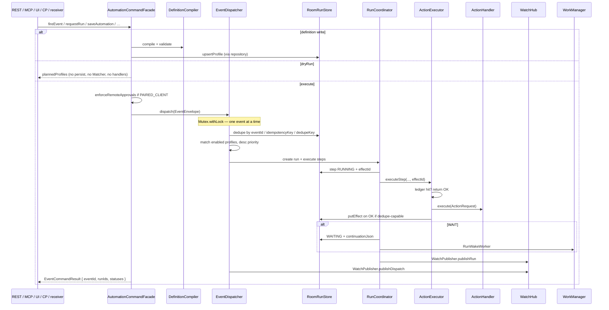

# Codebase map — AutoTask360 2.1.0

How the tree is laid out, who owns what, and how a command actually travels.

Runtime contract: [`../../spec.md`](../../spec.md). Topology: [`OVERVIEW.md`](OVERVIEW.md). Persistence: [`DATA.md`](DATA.md).

All production Kotlin lives under `app/src/main/java/com/example/`. The Play `applicationId` is `com.aistudio.autotask.svcqx`; the Gradle `namespace` and source packages are still `com.example`. Do not rename packages in a UI/docs PR.

## 1. Repo layout

```text
AutoTask-360/
  spec.md                          # Active runtime spec (do not fork)
  settings.gradle.kts              # include(":app") only
  app/build.gradle.kts             # applicationId, versionCode 8, versionName 2.1.0
  app/src/main/java/com/example/   # all product code
  app/src/main/jniLibs/arm64-v8a/libcosd.so
  app/src/main/res/                # adaptive icon, cacert.pem, themes, strings
  app/src/test/java/com/example/   # JVM + Robolectric
  app/src/androidTest/             # device tests (TursoConfig, …)
  docs/                            # this set + ops docs
  dev/AGENT_HARNESS_MCP.md
  dev/termux/openinterpreter/      # OI skill + watch.sh
```

Single module. `spec.md` §5 lists future `:autotask-*` modules; they are **not** in the tree.

## 2. Packages and owners

| Package | Path | Responsibility |
| --- | --- | --- |
| `application` | `app/src/main/java/com/example/application/` | Process wiring. `AutoTaskApplication`, `AutoTaskRuntime`, **`AutomationCommandFacade`**. Planned: `FeatureFlags` (typed SharedPreferences; Diagnostics toggles). |
| `domain` | `…/domain/` | Typed models, schema, codec, compiler, validator, `ProfileSearch`, `StepResumePolicy`, `StepRetryPolicy`, `RetentionLimits`. JVM-testable. |
| `data` | `…/data/` | Room entities/DAOs, `AutoTaskDatabase` v6, `RoomRunStore`, `RoomScheduleStore`, `LegacyAutoTaskMigration`, `PolicySeeder`, `RetentionSweeper`, `AutoTaskRepository`. |
| `engine` | `…/engine/` | Dispatcher, matcher, coordinator, executor, schedule manager, capability, schema JSON, watch bus. |
| `engine.actions` | `…/engine/actions/` | `ActionHandler`, `ActionRegistry`, handlers, TTS. |
| `server` | `…/server/` | Ktor command (8788) + watch (8787), `EventRequestParser`, `HttpSecurity`. |
| `mcp` | `…/mcp/` | `McpHandler`, `McpTools` (stateless MCP 2026-07-28). |
| `security` | `…/security/` | `AccessGuard`, principals, pairing, credentials, rate limit, redaction, high-risk policy, idempotency, audit. |
| `service` | `…/service/` | `AutoTaskService` FGS, receivers, WorkManager workers, notification listener. |
| `provider` | `…/provider/` | Non-exported `AutoTaskContentProvider`. |
| `ui` | `…/ui/` | `AutoTaskMainScreen`, `AutoTaskViewModel`, `theme/`. |
| `onboarding` | `…/onboarding/` | `CapabilityOnboarding` **scaffold only** — no Compose. |
| `wa` | `…/wa/` | Brain supervisor/client, Turso, WhatsApp bridge, health monitor. |
| `accessibility` | `…/accessibility/` | `CoSAccessibilityService` (eyes/hands). |
| `ota` | `…/ota/` | Signed APK self-update. |
| root | `MainActivity.kt` | Compose host; `enableEdgeToEdge()`. |

## 3. Key types

### 3.1 Command boundary

```text
AutomationCommandFacade          # single application boundary
  CommandContext + AccessPrincipal
  EventCommandResult
  ProfileNotFoundException
```

Transports **must not** call `AutoTaskRepository` or `ActionExecutor` directly. UI, REST, MCP, ContentProvider, and `SystemEventReceivers` go through the facade (receivers call `processEvent` → engine dispatch).

### 3.2 Definitions

```text
AutomationDefinition             # domain — typed, versioned
ActionStep { type, params }      # no effectId on the definition
AutomationProfile                # Room row — JSON columns + revision
CompiledAutomation               # DefinitionCompiler cache, invalidates on revision
ProfileListQuery / ProfileSearch # GET /v1/profiles?q=
```

Compile-on-write in `persistCompiled`. Invalid trigger/action/params fail before persistence (`DefinitionValidator`, `InvalidAutomationException`).

### 3.3 Events and runs

```text
EventEnvelope                    # eventId, type, source, occurredAt, receivedAt, dedupeKey, correlationId, payload
AutomationRun / StepRun / RunSnapshot
EffectRecord                     # ledger row
StepResumePolicy                 # safe / dedupe-capable / fail-closed
StepRetryPolicy                  # max 3, 100–400 ms, same effectId
ScheduleRegistration / ScheduleFire
```

Run statuses and step statuses: [`../../spec.md`](../../spec.md) §6.3. There is no `RETRYING` state.

### 3.4 Security

```text
PrincipalKind                    # LOCAL_DEVICE, DEBUG_LOOPBACK, INTERNAL_BRAIN, PAIRED_CLIENT, ANONYMOUS
AccessScope                      # READ, PROFILE_WRITE, EXECUTE, UI_CONTROL, OTA
AccessOperation                  # per-route
PairedCredential                 # SHA-256 of atc- token + scopes + approvedActions
HighRiskPolicy                   # SEND_SMS, CALL, UI_DRIVE, HTTP, WRITE_FILE, CAMERA, BRAIN_RPC, SCREEN_DUMP, …
```

### 3.5 Watch

```text
WatchFact { id, kind, occurredAt, body }
WatchHub                         # capacity 100, subscribe/publish
WatchBus.hub                     # process singleton
WatchPublisher                   # event / event.deduped / run
```

## 4. How a command travels



### 4.1 REST

`KtorLoopbackServer` (`app/src/main/java/com/example/server/KtorLoopbackServer.kt`):

1. `HttpSecurity` / `AccessGuard.authenticate` (host + bearer).
2. `authorize` against `AccessOperation`.
3. Parse JSON → facade method.
4. `AutomationCommandFacade.profileToJson` / `runToJson` / `logToJson` for the response.

Selected routes:

| Method | Path | Facade |
| --- | --- | --- |
| GET | `/v1/status` | status + brain supervisor + watch flag |
| GET | `/v1/schema` | `SchemaProvider` |
| GET | `/v1/capabilities` | `CapabilityProvider` |
| GET | `/v1/profiles?q=` | `listProfiles(ProfileListQuery)` |
| POST | `/v1/events` | `fireEvent` (`dryRun` supported) |
| POST | `/v1/runs` | `requestRun` |
| GET/POST | `/v1/runs/{id}` + cancel/retry/resume | `getRun` / `cancelRun` / `retryRun` / `resumeRun` |
| GET/POST | `/v1/schedules*` | `listSchedules` / `reconcileSchedules` |
| POST | `/v1/brain` | `BrainClient.call` (not the facade execute path) |
| POST | `/v1/pairing/*` | `PairingManager` (loopback admin) |

### 4.2 MCP

`McpHandler` + `McpTools`. Stateless MCP (`2026-07-28`). Every call carries `_meta` + mirrored headers. Tools are thin wrappers:

- `autotask.schema` / `capabilities` / `profiles.*` / `events.fire` / `runs.*` / `schedules.*` / `logs.list` → facade
- `aware.*` / `crm.*` → brain RPC via `BrainClient`

`/mcp` always requires a bearer, even on debug loopback.

### 4.3 UI

`AutoTaskViewModel` holds `AutomationCommandFacade.getInstance`. It also **HTTP-calls loopback** for the Status tab API tester (OkHttp to `127.0.0.1:8788`). Profile CRUD and FIRE ALL go through the facade, not through a second executor.

Tabs (today): `PoliciesTab`, `CatalogueTab`, `LogsTab`, `EventsTab`, `StatusTab` in `AutoTaskMainScreen.kt`.

### 4.4 ContentProvider

`AutoTaskContentProvider` authority `com.example.autotask.provider` (`exported=false`). `query`/`insert` for status, profiles, events, logs via `runBlocking` + facade.

### 4.5 Event sources

`SystemEventReceivers` → `commands.processEvent(AutomationEvent)` → `AutoTaskEngine.processEvent` → `dispatch`. Same mutex as REST.

## 5. Action registry

`ActionRegistry.standardHandlers()` (`engine/actions/ActionRegistry.kt`). Adding an action = implement `ActionHandler` + append to that list. No central `when (type)` in the executor.

| File | Types (non-exhaustive) |
| --- | --- |
| `CommunicationHandlers.kt` | `SEND_SMS`, `CALL`, `OPEN_URL` |
| `AlertHandlers.kt` | `NOTIFICATION`, `SPEAK`, `TOAST`, `VIBRATE` |
| `DataAndFlowHandlers.kt` | `HTTP`, `WRITE_FILE`, `READ_FILE`, `WAIT`, `LOG`, `CLIPBOARD` |
| `AppAndHardwareHandlers.kt` | `LAUNCH_APP`, `SEND_INTENT`, `FLASHLIGHT`, `BROADCAST`, `OPEN_SETTINGS` |
| `DeviceStateHandlers.kt` | `AUDIO`, `DND`, `BRIGHTNESS`, `SCREEN_TIMEOUT`, `ROTATION` |
| `CameraActionHandler.kt` | `CAMERA` |
| stubs via `PolicyStubActionHandler` | `POWER_SAVE`, `WIFI_ACTION`, `BLUETOOTH_ACTION`, `AIRPLANE_MODE_ACTION`, `HOTSPOT`, `NFC_ACTION`, `KILL_APP` — today they can return `OK` with no side effect; Phase 1.4 must return `SKIPPED` / `not_implemented` |

`SEND_SMS` today: `SmsManager.sendTextMessage(number, null, text, null, null)` — sent/delivered `PendingIntent`s are null. Phase 1 parks as `WAITING` `kind=sms_sent`. `execute` / `recoverIncomplete` / `RunWakeWorker` must branch on `continuationJson.kind`: `sms_sent` **must not** call `completeWaitStep` (duration WAIT’s `OK` path). Deadline → `FAILED` `sms_radio_timeout`. See [`../product/ROADMAP.md`](../product/ROADMAP.md).

`WAIT` does not run inside the handler as a sleep; the coordinator intercepts `type == "WAIT"` and persists a continuation.

## 6. Startup order

```text
AutoTaskApplication.onCreate
  → AutoTaskRuntime.start (once)
      → AutoTaskEngine.getInstance (lazy, no side effects)
      → engine.start() on IO
          → seedDefaultRecipesIfNeeded (PolicySeeder cos-* profiles)
          → coordinator.recoverIncomplete()
          → scheduleManager.reconcile("startup")
          → RetentionSweeper.prune()
          → warmLocation()

MainActivity / AutoTaskViewModel.init
  → seedDefaults again (idempotent)
  → AutoTaskService.startService
      → startForeground
      → start Ktor 8788
      → start Watch 8787
      → register SystemEventReceivers
```

`BrainService` is a **separate** FGS. Harness docs start it with `am start-foreground-service … BRAIN_START`. It is not started from `AutoTaskApplication`.

Supervisor: health every 2s, backoff 2s→60s, kill-switch after 4 crashes in 120s (`BrainService`).

## 7. Tests that lock the map

| Area | Tests |
| --- | --- |
| Facade | `AutomationCommandFacadeTest` |
| Search | `domain/ProfileSearchTest` |
| Resume / retry | `domain/StepResumePolicyTest`, `StepRetryPolicyTest` |
| Effect ledger | `engine/ActionExecutorEffectTest` |
| Coordinator | `engine/RunCoordinatorTest` |
| Registry | `engine/actions/ActionRegistryTest` |
| Watch | `engine/WatchHubTest` |
| DB paths | `data/AutoTaskDatabasePathTest` |
| Retention | `data/RetentionSweeperTest` |
| Security | `security/AccessControlTest`, `ReleaseManifestTest` |
| MCP | `McpToolsTest` |
| Brain spawn paths | `wa/BrainServiceTest` |
| Onboarding map | `onboarding/CapabilityOnboardingTest` |

Gates in `spec.md` §14 (`testDebugUnitTest`, lint, no transport-to-repository execute path) still apply to every PR in [`../product/ROADMAP.md`](../product/ROADMAP.md).

## 8. What is *not* in this tree

- No Glance / `AppWidgetProvider`
- No Android 12 `SplashScreen` theme / `core-splashscreen`
- No Navigation-Compose graph (tab int, not routes)
- No Gradle feature modules
- No Headroom / SmartCrusher sources (port collision is operational; see [`OVERVIEW.md`](OVERVIEW.md) §2)
- No Mac CoS sources (sibling `chief-of-staff/` is out of this product)
