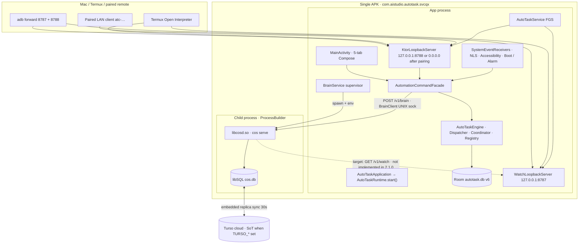

# AutoTask360 2.1.0 — system architecture (as shipped)

Status: descriptive of **today**. Not a target-state document.

Authoritative runtime contract: [`../../spec.md`](../../spec.md) (Status: Active — AutoTask360 2.1.0).

Companion maps: [`CODEBASE.md`](CODEBASE.md), [`DATA.md`](DATA.md), [`REPOS.md`](REPOS.md).

## 1. What this product is

**Adjutant** is the user-facing product. The APK is still the AutoTask360 2.1.0 **Android automation runtime**:

| Field | Value | Source |
| --- | --- | --- |
| `applicationId` | `com.aistudio.autotask.svcqx` | `app/build.gradle.kts` |
| Gradle `namespace` | `com.example` | same file (Kotlin packages have not been renamed) |
| `versionName` | `2.1.0` | same file |
| `versionCode` | `8` | same file |
| `minSdk` / `targetSdk` | 24 / 36 | same file |
| Launcher label | `AutoTask` | `app/src/main/res/values/strings.xml` |
| Single Gradle module | `:app` | `settings.gradle.kts` |

It is **not** Tasker. The phone is the CoS body. The runtime is a **single-worker durable-run ledger**: one in-process dispatch mutex, checkpointed steps, an effect ledger, and a privileged CoS path. Temporal is an analogy for *product shape only* (durable run, activity identity via `effectId`, timers, visibility). This is not Temporal replay, not Kubernetes, and not a general distributed workflow platform.

The APK also ships an optional **on-device CoS brain**: the Rust PIE `libcosd.so`, supervised by `BrainService`. The brain is a client of the runtime. It does not open `autotask.db` and does not call Android APIs.

The Mac harness, Codex, and LAN remotes are optional narrower clients. They are **not** part of the Android product architecture ([`spec.md`](../../spec.md) §3).

## 2. Processes and ports

| Port / path | Bind | Owner | Purpose |
| --- | --- | --- | --- |
| **8787** | `127.0.0.1` only | `WatchLoopbackServer` | `GET /v1/watch`, SSE `/v1/watch/stream`. Reserved; command will not bind it (`KtorServerConfig.LISTENER_PORT`). |
| **8788** | `127.0.0.1` default; `0.0.0.0` after pairing + LAN enable | `KtorLoopbackServer` | Command REST + MCP. `KtorServerConfig.DEFAULT_PORT`. |
| **UNIX socket** `files/brain/cosd.sock` | filesystem, app-private | `libcosd.so` | Engine ↔ brain RPC. Preferred. |
| **8790** | `127.0.0.1` when `debug_tcp` | `libcosd.so` | Debug TCP. `BrainService.DEFAULT_PORT`. Notification text still says this even when sock-only. |
| ContentProvider | `content://com.example.autotask.provider` | `AutoTaskContentProvider` | Non-exported; status / profiles / events / logs via the facade. |

**Port hazard.** 8787 is reserved for watch. Headroom (SmartCrusher), a separate context-compression product, defaults its proxy to 8787. If that process is on the phone, `WatchLoopbackServer` fails to bind and `/v1/status` reports `watch_running: false`. Do not move watch off 8787 without updating Termux `watch.sh`, the schema catalog, and `spec.md`. Move Headroom instead.

## 3. Component table (today)

| Component | File | Owns | Must not own |
| --- | --- | --- | --- |
| `AutoTaskApplication` | `app/src/main/java/com/example/application/AutoTaskApplication.kt` | Process start → `AutoTaskRuntime.start()` | Command logic |
| `AutoTaskRuntime` | `…/application/AutoTaskRuntime.kt` | Once-only seed / recover / reconcile / prune | Transport |
| `AutomationCommandFacade` | `…/application/AutomationCommandFacade.kt` | Public commands, compile-on-write, remote approval gate | Android APIs, HTTP framing |
| `AutoTaskEngine` | `…/engine/AutoTaskEngine.kt` | Wires store, dispatcher, coordinator, executor, schedule manager | Protocol |
| `EventDispatcher` | `…/engine/EventDispatcher.kt` | Global `Mutex`; admit / dedupe / match / create runs | Handler I/O |
| `RunCoordinator` | `…/engine/RunCoordinator.kt` | Checkpointed steps, retry, resume, WAIT wake | Transport |
| `ActionRegistry` / handlers | `…/engine/actions/` | Type → handler, capability, timeout, risk metadata | Profile matching |
| `ActionExecutor` | `…/engine/ActionExecutor.kt` | Effect-ledger consult + commit for dedupe-capable types | Policy |
| `ScheduleManager` | `…/engine/ScheduleManager.kt` | Next-fire, AlarmManager vs WorkManager | Action execution |
| `WatchHub` / `WatchPublisher` | `…/engine/WatchHub.kt`, `WatchPublisher.kt` | In-memory ring (100 facts); publish events and terminal runs | Persistence |
| Room | `…/data/AutoTaskDatabase.kt` | `autotask.db` v6 | Rust state |
| `BrainService` | `…/wa/BrainService.kt` | Spawn `libcosd.so`, env, CA bundle, crash backoff | Room |
| `BrainClient` | `…/wa/BrainClient.kt` | UNIX-socket HTTP/JSON to the daemon | Room handles |
| `TursoConfig` | `…/wa/TursoConfig.kt` | EncryptedSharedPreferences for `TURSO_URL` / `TURSO_TOKEN` | Runtime ledger |
| Ktor / MCP / CP / UI | `server/`, `mcp/`, `provider/`, `ui/` | Thin adapters | Matching or execute |

`spec.md` §5 names future Gradle modules (`:autotask-domain`, `:autotask-runtime`, …). **2.1.0 stays in `app` packages.** Extraction is deferred until contracts stabilize.

## 4. Persistence split

| Store | Path | Owner | Contents |
| --- | --- | --- | --- |
| `autotask.db` | `context.getDatabasePath("autotask.db")` → `databases/autotask.db` | Room (`AutoTaskDatabase`, version **6**) | Profiles, events, runs, steps, `effect_records`, schedules, execution logs |
| `cos.db` | `context.getDir("brain")/cos.db` | Rust `LibSqlStore` | CRM, calendar, principals, entities, memory |
| Turso | `TURSO_URL` + `TURSO_TOKEN` | Cloud, when configured | **Source of truth** for CoS memory; phone holds an embedded replica |

They never share a SQLite file. Before PR2, Room derived its path from `BrainService.dbPath`. `LegacyAutoTaskMigration` reads that former shared file **once, read-only**, then Room uses only `autotask.db`. Details: [`DATA.md`](DATA.md).

## 5. Trust principals

Defined in `app/src/main/java/com/example/security/AccessModels.kt`. Enforced by `AccessGuard` on HTTP/MCP. On-device UI, broadcasts, and the scheduler call the facade with `CommandContext.LOCAL` and **do not use tokens**.

| `PrincipalKind` | How obtained | Autonomy |
| --- | --- | --- |
| `LOCAL_DEVICE` | In-process (UI, receivers, scheduler) | Full scopes. Executes after Android permissions + capability policy. Not gated by `approvedActions`. |
| `INTERNAL_BRAIN` | Bearer `cos-…` on **loopback only** | Same privileged path as local. Token rejected on LAN (`INTERNAL_TOKEN_ON_LAN`). |
| `DEBUG_LOOPBACK` | Debug build, loopback, no token, **not** `/mcp` | Full scopes. MCP still requires a bearer. |
| `PAIRED_CLIENT` | Bearer `atc-…` after pairing | Scoped (`READ`, `PROFILE_WRITE`, `EXECUTE`, `UI_CONTROL`, `OTA`). High-risk types need `approvedActions` or `403 APPROVAL_REQUIRED`. |
| `ANONYMOUS` | Missing / bad token | Denied |

Human approval is a **runtime facility** for remotes and opted-in definitions (`riskPolicy.requireConfirmation` is persisted; 2.1.0 does not enforce it against the CoS path). CoS on-device is **not** gated per action. See [`spec.md`](../../spec.md) §1 and §10, and [`../LAN_SECURITY.md`](../LAN_SECURITY.md).

## 6. Command and watch surfaces

Command (8788) routes in `KtorLoopbackServer`: pairing, status, schema, capabilities, profiles (including `GET /v1/profiles?q=`), events, runs, schedules, logs, brain proxy, HTTP proxy, contacts, location, screen/UI drive, OTA, WhatsApp.

Watch (8787) is a **second** Ktor CIO server. It publishes `WatchPublisher` facts: admitted events (`event` / `event.deduped`) and terminal runs (`run`), including `INDETERMINATE`. Termux Open Interpreter subscribes (`dev/termux/openinterpreter/skills/autotask/SKILL.md`). **The Rust daemon does not subscribe in 2.1.0** — that is the Phase 2 loop-closure gap ([`../product/ROADMAP.md`](../product/ROADMAP.md)). [`../../spec.md`](../../spec.md) §1 already says the brain subscribes (contract). Treat that as **target**, not shipped: *2.1.0 ships the watch socket; the Rust subscriber lands in 2.2.* Do not edit `spec.md` until a runtime PR touches it.

Profile resolve for CoS: `ProfileSearch` / `ProfileListQuery` behind `GET /v1/profiles?q=` and MCP `autotask.profiles.list`. Unfiltered list still dumps the catalog; clients must pass `q` or `id`.

## 7. Durable execution (pointer)

Run/step statuses, `effectId`, resume/retry, WAIT, and retention are defined only in [`spec.md`](../../spec.md) §6. Do not copy those lists here (they already drifted in [`../TROUBLESHOOTING.md`](../TROUBLESHOOTING.md) vs 2.1.0 `SEND_SMS` ledger).

**Shipped fact that is not in spec:** `SendSmsActionHandler` still calls `SmsManager.sendTextMessage(..., sentIntent=null, deliveryIntent=null)` and returns `OK` on enqueue. Phase 1 parks `SEND_SMS` as `WAITING` until a sent-intent (`docs/product/ROADMAP.md`). Queue bound `MAX_INCOMPLETE_EVENTS = 100` is an implementation constant on `RunCoordinator`, not a spec status.

## 8. Event ingress and scheduling

Ingress is **not** matching. `SystemEventReceivers` (registered by `AutoTaskService`) converts SMS, battery, power, Wi-Fi, Bluetooth, airplane, headset, USB, etc. into `AutomationEvent`s and calls the facade. `AutoTaskNotificationListener` posts notification events. `BootReceiver` restarts the service and lets runtime reconcile. `ScheduleAlarmReceiver` + `TimeTriggerWorker` + `RunWakeWorker` deliver scheduled work as events.

Scheduling: exact user-visible times → `AlarmManager`; flexible work → `WorkManager`; 5-field cron on `SCHEDULE`; optional IANA `timezone`; DST gaps skip to the next valid local time.

## 9. UI today vs target

Today is a **thin operator lab**, not the product:

- `MainActivity` → `AutoTaskMainScreen` + `AutoTaskViewModel`
- Bottom nav: **POLICIES · CATALOGUE · LOGS · EVENTS · STATUS**
- Light Material3 “HighDensity” palette (`Color.kt`); `MyApplicationTheme` ignores `darkTheme`
- `enableEdgeToEdge()` is on; there is no cutout-aware chrome, no SplashScreen API theme, no Glance/App Widgets, no live-status chip
- `CapabilityOnboarding` is a **scaffold** (Kaneo #8) — it does not render
- Four foreground services (do not collapse in Phase 5):

| Service | `NOTIFICATION_ID` | Role | Phase 5 |
| --- | --- | --- | --- |
| `AutoTaskService` | 8788 | Engine + Ktor + watch | Situation copy **replaces** “AutoTask Engine Running” / channel “Tool Server Heartbeat” |
| `WhatsAppBridgeService` | 8789 | WA WebView bridge | Stays |
| `BrainService` | 8791 | Supervises `libcosd.so` (separate process) | **Must stay** a distinct FGS |
| `HealthMonitor` | 8792 | Special-access drift | Stays |

Target surfaces: [`../product/UI_UX.md`](../product/UI_UX.md), [`../product/DESIGN_SYSTEM.md`](../product/DESIGN_SYSTEM.md), [`../product/BRAND.md`](../product/BRAND.md).

## 10. Repo topology

This working tree is `/Users/hodgeluke/Desktop/Projects/AutoTask-360`.

| Remote | URL | Role |
| --- | --- | --- |
| `origin` | `https://github.com/DSamuelHodge/AutoTask-360.git` | Primary |
| `sapphire-blu` | `https://github.com/DSamuelHodge/Sapphire-Blu.git` | **Decommission.** Was identical at `0d3f513`. Do not push. Operator deletes the GitHub repo and removes this remote. |

Brain source (sibling, not a Gradle subproject): `/Users/hodgeluke/Desktop/Projects/agent-cal-crm` → ships as `app/src/main/jniLibs/arm64-v8a/libcosd.so`.

Historical split and current ownership: [`REPOS.md`](REPOS.md).

## 11. Constraints that still hold

From operator brief and `spec.md` §3 / §5:

- Stay in `app` packages unless a later extraction PR is explicitly scheduled.
- Typed Kotlin + `org.json` at the command boundary. Preserve external JSON shapes.
- REST / MCP / UI / ContentProvider stay thin over the facade.
- 8787 reserved for watch. OI lives in Termux.
- Do not share a SQLite file between Room and Rust.
- Do not make Mac CoS part of the Android product architecture.
- Do not invent a second runtime spec.
