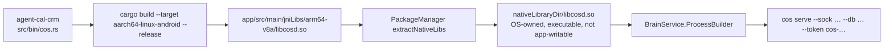

# Repositories — AutoTask-360 and Cal-CRM

Status: 2026-08-18. Face product name is **Adjutant**. This repo remains AutoTask-360.

This working tree: `/Users/hodgeluke/Desktop/Projects/AutoTask-360`.

## 1. Remotes

**Going forward the only remote is `origin`:**

```text
origin        https://github.com/DSamuelHodge/AutoTask-360.git   (fetch/push)
```

`HEAD` of `main` at documentation time: `0d3f513 Release 2.1.0`.

### Sapphire-Blu — decommission

This clone may still list `sapphire-blu` → `https://github.com/DSamuelHodge/Sapphire-Blu.git`. Historically both remotes were **identical at `0d3f513`**. That is not a second product.

**Operator actions (not this docs pass — do not run them here):**

1. `git remote remove sapphire-blu` on this clone.
2. Delete the GitHub repository `DSamuelHodge/Sapphire-Blu` when ready.
3. Do **not** fast-forward or push to Sapphire-Blu.

Until those happen, treat any leftover `sapphire-blu` remote as dead.

Historical G63 serial in harness docs: `1010018024018888` (`dev/AGENT_HARNESS_MCP.md`). Device id, not a product id.

## 2. What each name meant

| Name | What it was | What it is now |
| --- | --- | --- |
| **AutoTask-360** | Android automation runtime repo | **This product.** APK `com.aistudio.autotask.svcqx`, runtime spec `spec.md`, docs in `docs/`. |
| **Sapphire-Blu** | Parallel / earlier name for the same phone runtime | **Decommission.** Was identical to AutoTask-360 at `0d3f513`. Delete the GitHub repo; remove the local remote. |
| **Cal-CRM / agent-cal-crm** | Rust calendar + CRM library + `cos` daemon | **Brain source.** Sibling checkout `/Users/hodgeluke/Desktop/Projects/agent-cal-crm`. Built as `cos`, packaged as `libcosd.so`. |
| **agentcal-rs** | Earlier / slim calendar crate at `/Users/hodgeluke/Desktop/Projects/agentcal-rs` | Library-shaped predecessor. The daemon + CoS schema live in `agent-cal-crm`. Do not add a second brain. |
| **chief-of-staff** | Sibling Android project at `/Users/hodgeluke/Desktop/Projects/chief-of-staff` | **Out of this product.** `spec.md` §3: do not make Mac/other CoS part of the Android architecture. |

`metadata.json` still describes the AI Studio envelope (“On-device AI agent tool server…”). That is packaging metadata, not the architecture.

## 3. How the brain enters the APK



- The `.so` is a **PIE executable**, not a `dlopen` library. `BrainService` documents why: Android 10+ W^X forbids `exec` from `filesDir`.
- `app/build.gradle.kts` sets `jniLibs.useLegacyPackaging = true`. AGP writes `android:extractNativeLibs="true"` on the **merged** manifest (`app/build/intermediates/merged_manifests`), which materializes the binary into `nativeLibraryDir`.
- Updating the brain **is an APK install** (OTA path). There is no hot-swap of `libcosd.so` from app storage.

`agent-cal-crm/docs/ARCHITECTURE.md` is a team overview of the combined system. Where it conflicts with [`../../spec.md`](../../spec.md) (for example older “LLM in the hot path” wording), **`spec.md` wins** for the Android runtime.

## 4. Historical split vs now

### Then

- Room path was derived from `BrainService.dbPath` — Android and Rust could land on one SQLite file.
- Sapphire-Blu and AutoTask-360 were discussed as two trees.
- Brain was imagined as Termux-hosted (`agent-cal-crm/README.md` still mentions Termux + `adb forward` to 8788 — that README’s default `--addr 127.0.0.1:8788` **collides with command** and is stale relative to the Android supervisor, which uses sock / 8790).
- Open Interpreter lived in Termux and still does (`dev/termux/openinterpreter`). It is a **subscriber**, not the brain.

### Now (2.1.0)

- One APK, two processes, two databases ([`DATA.md`](DATA.md)).
- One command port (8788) and one watch port (8787).
- One live remote (`origin`). Sapphire-Blu was the same commit at `0d3f513` and is being deleted.
- Brain is in-process-UID, supervised, Turso-optional.
- OI remains in Termux and watches 8787; it must not be rewritten as the on-device CoS.

## 5. Ownership going forward

| Change | Lands in |
| --- | --- |
| Runtime, facade, Room, Ktor, Compose, pairing, OTA | **AutoTask-360** `app/` (this repo) |
| CRM/calendar schema, `aware.*` RPC, libSQL/Turso open | **agent-cal-crm**, then a new `libcosd.so` drop into `jniLibs/` |
| Harness / OI prompts | `dev/` in this repo |
| Mac harness | Not this architecture |
| Headroom / SmartCrusher | Separate product. **Will leave 8787** (operator). Watch stays. |

**Push only to `origin` (AutoTask-360.git).** Do not mirror to Sapphire-Blu.

## 6. Product naming vs repo naming

Repo name AutoTask-360 stays. Face name is **Adjutant** ([`../product/BRAND.md`](../product/BRAND.md)). Package `com.aistudio.autotask.svcqx` **does not change**. `spec.md` may keep the AutoTask360 2.1.0 title until a later runtime PR. v1 ships **sideload only** — the package id is not a Play listing in this phase.
