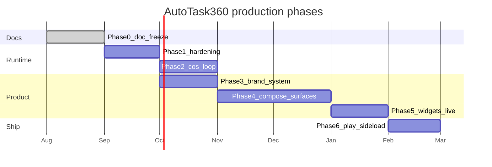
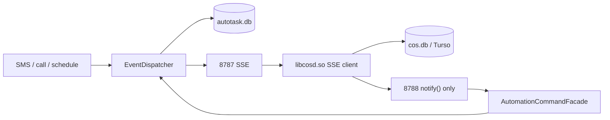

# Production roadmap — AutoTask360 2.1.0 → shippable CoS-on-phone

Status: Draft plan. Does not change runtime semantics; those stay in [`../../spec.md`](../../spec.md).

This roadmap is **product-shaped**. UI/UX is a first-class track, not a leftover after the ledger. The phone is the CoS body: situation, actuation, and operator visibility — not a chat wrapper, not Tasker.

Companion specs: [`UI_UX.md`](UI_UX.md), [`DESIGN_SYSTEM.md`](DESIGN_SYSTEM.md), [`BRAND.md`](BRAND.md). Architecture as shipped: [`../architecture/OVERVIEW.md`](../architecture/OVERVIEW.md).

## North star

A G63-class Android phone running this APK:

1. **Watches** via 8787 (brain + OI subscribe; they do not poll Room).
2. **Acts** via 8788 / UNIX sock as `INTERNAL_BRAIN` / `LOCAL_DEVICE`.
3. **Remembers** in `cos.db` (Turso SoT when configured).
4. **Audits** in `autotask.db` (Room v6 + effect ledger).
5. **Shows** a branded, cutout-safe operator surface: situation home, run timeline, pairing, diagnostics — plus widgets and an ongoing live-status notification.

Human approval remains a facility for remotes and opted-in definitions. CoS on-device is not gated per action.

## Constraints that apply to every phase

- Stay in `app` packages unless a later PR documents a module extraction (`spec.md` §5).
- Typed Kotlin + `org.json`. Preserve external JSON.
- REST / MCP / UI / ContentProvider stay thin over `AutomationCommandFacade`.
- 8787 reserved for watch. Headroom/SmartCrusher must not bind it.
- Never share a SQLite file between Room and Rust.
- Mac CoS is not part of this architecture.
- `spec.md` remains the runtime contract. If a phase needs a semantic change, update `spec.md` in the same PR.

## Phase overview

Phase 3 may start in parallel with Phase 2 (brand assets do not require the brain subscriber). Phase 4 must not start before Phase 3 tokens exist. Phase 5 depends on Phase 4 navigation + situation model.

Suggested versioning (operator-owned; `versionCode` is monotonic per [`../RELEASE_SIGNING.md`](../RELEASE_SIGNING.md)):

| Phase | Target `versionName` | `versionCode` |
| --- | --- | --- |
| 0 (now) | 2.1.0 | 8 |
| 1 | 2.1.x | **+1 per sideloadable merge** (9, 10, …) |
| 2 | 2.2.0 | +1 |
| 3 | 2.3.x | +1 per icon/splash/token drop |
| 4 | 2.3.x continued | +1 per production-UI drop |
| 5 | 2.4.x | +1 |
| 6 | 2.5.x sideload | +1 (no Play listing in v1) |

`versionCode` is monotonic per [`../RELEASE_SIGNING.md`](../RELEASE_SIGNING.md). Do not assign one bump to all of Phases 3–4.

## Phase 0 — Documentation freeze (this work)

**Goal.** Slow down after the 2.1.0 architecture updates. Write the map before more Kotlin.

**In scope**

- This `docs/` set.
- Cite `spec.md`; do not fork it.
- Record operator decisions (Adjutant, amber-on-ink, sideload v1, `COS_OWNER`, Headroom off 8787, Sapphire-Blu decommission).

**Out of scope**

- Product code, Gradle, APK, `libcosd.so`.

**Exit criteria**

- [x] `docs/README.md` indexes architecture, product, and existing ops docs.
- [x] Architecture docs describe 2.1.0 as it exists (Room v6, 8787/8788, principals, remotes at `0d3f513`).
- [x] Roadmap includes UI/UX, widgets, live status, branding, Play/sideload.
- [x] Face name **Adjutant**; package/runtime still AutoTask360; no silent `applicationId` change.

## Phase 1 — Runtime hardening

**Goal.** Close the remaining honesty gaps in the durable-run ledger without changing the product shape.

**Work**

1. **SMS sent-intent — WAIT-like park (normative).** See master design §3.1. Handler sends **once** with a **sent-only** `PendingIntent`, returns immediately. Persist `WAITING` + `continuationJson.kind=sms_sent`. **Do not share duration-WAIT completion.**
   - `execute` / `recoverIncomplete` / `RunWakeWorker` **must read `continuationJson.kind`**. `kind=sms_sent` **must not** call `completeWaitStep` (that marks duration WAIT `OK` — delayed lie).
   - Deadline / wake of `sms_sent` → `completeStep(..., FAILED, sms_radio_timeout)` only.
   - `RESULT_OK` sent-intent → `completeStep(..., OK)` + effect ledger + **cancel** the wake.
   - Recover with future `deadlineAt`: re-register non-exported receiver **and** reschedule wake; **do not send again**.
   - Missing `kind` (2.1.0 `{durationMs, wakeAt}` rows) stays duration WAIT → `completeWaitStep`.
   - `SMS_SENT_TIMEOUT_MS = 20_000`, independent of the 30 s step/handler timeouts.
   - Radio timeout / send error is **not** `StepRetryPolicy`-retryable. Operator `retryRun` → **new** `effectId`.
   - Same-PR `spec.md` §6.3: `SEND_SMS` `OK` means sent-intent (or emulator fallback). Do not edit `spec.md` until that PR.
2. **Per-profile retry JSON (only if warranted).** Not used for radio timeout. Global `StepRetryPolicy` stays unless a non-radio test requires override.
3. **Watch completeness.** (a) JVM test: fail-closed resume emits `kind=run` `INDETERMINATE`. `onTerminal` already publishes terminals; `cancelRun` publishes separately. (b) **WAIT wake is not a watch event** — do not add `kind=run.update` in Phase 1.
4. **Ops doc fix.** Update [`../TROUBLESHOOTING.md`](../TROUBLESHOOTING.md) resume table so `SEND_SMS` is 2.1.0 dedupe-capable, not 2.0 fail-closed.
5. **Stub honesty.** Done: `PolicyStubActionHandler` returns `SKIPPED` / `not_implemented`. Schema `state` is `policy-ready`.

**Dependencies:** Phase 0.

**Risks**

| Risk | Sev | Mitigation |
| --- | --- | --- |
| Sent-intent never arrives on some OEMs | High | 20 s timeout → `FAILED`; no second send; operator `retryRun` is a new `effectId` |
| Holding dispatch mutex during SMS wait | High | **Rejected.** Park like `WAIT`; mutex released. Test: second event dispatches in-flight. |
| `StepRetryPolicy` re-sends on timeout | High | Radio failures are not retryable. |
| Per-profile retry bikeshed | Low | Ship park first. |

**Exit criteria**

- Instrumented: `OK` only after sent-intent (or documented emulator fallback).
- Timeout does **not** send a second SMS.
- Crash mid-window does not re-send; ledger / continuation still holds the `effectId`.
- Second event dispatches while SMS is parked.
- `GET /v1/watch` contains the `INDETERMINATE` run after a fail-closed resume.
- Stubs no longer return `OK`.
- No new transport-to-repository execute path.

## Phase 2 — Close the CoS loop

**Goal.** Subscribe on **8787**. Remember **in-process** (`aware.sms` as shipped → `crm.log_interaction`). Notify via existing 8788 **`notify()`** only (`POST /v1/events` `cos-informed-notify`). No inverse RPC. Do not auto-fire the original SMS profile. Never `retryRun`.

**Today.** Termux OI already tails 8787. `libcosd.so` has no watch client. `aware.rs` already: logs CRM in-process; `notify()` POSTs `/v1/events` `{triggerType:MANUAL, profileId:cos-informed-notify}` via **`AUTOTASK_URL`** with **no** `Authorization` header (401 on release).

**Mini-spec (normative; same as master design §2)**

| Item | Contract |
| --- | --- |
| Watch client | ~50–100 line loopback GET/SSE parser. No `reqwest`. |
| `AUTOTASK_WATCH_URL` | default `http://127.0.0.1:8787/v1/watch/stream` |
| `AUTOTASK_URL` | **existing** `aware.rs` env, default `http://127.0.0.1:8788`. Do not invent `AUTOTASK_COMMAND_URL` except as an alias. |
| `COS_OWNER` | **Required** before 2.2. CRM / `aware.*` owner. Empty fails spawn/seed. No `"derrick"` default. |
| `notify()` deltas (2.2) | `Authorization: Bearer <cos-token>`; `source=cos`; `correlationId=cos-<uuid>`. Do not log the bearer. |
| Memory | In-process `rpc::dispatch` / `crm.log_interaction`. Not a hairpin `POST /v1/brain`. |
| Reconnect | 2 s → 60 s. `GET /v1/watch?limit=50` then SSE. |
| Catch-up | Missed facts while dead are **acceptable** in 2.2. |
| Ignore own | Drop watch facts with `source=cos` / `correlationId` prefix `cos-`. |

**WatchFact → action (2.2)**

| Fact | Action |
| --- | --- |
| `kind=event` `SMS` | **`aware.sms` as shipped**: in-process CRM + `notify()` → `cos-informed-notify`. Do **not** re-fire the inbound SMS profile. **Never** `retryRun`. |
| `kind=event` `INCOMING_CALL` | `aware.call` as shipped. |
| other `event` / `event.deduped` | no-op |
| `kind=run` | ignore if own (`source=cos`); else optional extra log. **Never** `retryRun`. |

`notify()` is allowed in 2.2 (existing informed-notification profile, not a new `requestRun`). Anticipatory allow-listed `requestRun` is later.

`FeatureFlags.brain.watch` default **off** until the `.so` drop is verified (Diagnostics, `LOCAL_DEVICE`). Headroom on 8787 → `BrainService.lastError`, no Room poll.

**Dependencies:** Phase 1 watch test (1.1). New `libcosd.so`.

**Risks**

| Risk | Sev | Mitigation |
| --- | --- | --- |
| Feedback loop | High | `source=cos` / `correlationId` prefix |
| Overnight SMS while brain halted | Med | **Accepted** in 2.2; interaction may be absent; no duplicate send |
| Binding 8787 from Rust | High | Client only |
| `reqwest`/rustls on Android | Med | Do not add that crate for loopback |

**Exit criteria**

- Inbound SMS → watch → `aware.sms` (in-process CRM) → `notify()` `cos-informed-notify` with Bearer + `source=cos`.
- Do not re-fire the original SMS profile. Never `retryRun`.
- Brain down during SMS → **no duplicate send**; interaction **may be absent**.
- Kill `libcosd.so`; supervisor restarts; stream reconnects.
- Release loopback `notify()` does not 401.
- No inverse RPC. No Room open.

## Phase 3 — Brand + design system + icon/splash

**Goal.** Ship the **Adjutant** face (amber-on-ink) without changing `applicationId`. See [`BRAND.md`](BRAND.md), [`DESIGN_SYSTEM.md`](DESIGN_SYSTEM.md).

**Work**

1. Design tokens in `ui/theme/` (color, type, elevation, motion). Dark-first.
2. Adaptive icon (replace server-stack + lightning) + monochrome.
3. Android 12 `SplashScreen` API. Timed **400–1200 ms**. `setKeepOnScreenCondition` on a new `AutoTaskRuntime.runtimeReady` that flips **after** `engine.start()`, **not** `isStarted()` (that flag is true before the IO work). Cap 1.2 s; first frame may still have empty lists.
4. Notification small icon + channel names that match the chosen wordmark **or** a name-agnostic mark if the rename is still open.
5. Do **not** change `applicationId` in this phase.

**Dependencies:** Phase 0. Can parallel Phase 2.

**Exit criteria**

- Tokens documented and implemented; contrast checked (WCAG AA).
- Cold start shows branded splash then situation/home (even if home is still the 2.1.0 tabs behind a flag).
- Launcher icon is no longer the placeholder stack+bolt, unless the operator explicitly keeps it.

## Phase 4 — Production Compose surfaces

**Goal.** Replace the lab shell with the IA in [`UI_UX.md`](UI_UX.md).

**Work** (feature-flagged via `FeatureFlags`; keep Status API tester behind `ui.diagnostics.advanced`)

0. **Room v7 principal persistence (PR 4.0, before Home).** `automation_runs.principalKind` / `principalId` from `CommandContext` at admission. `spec.md` in the same PR. Infer-from-source is **rejected**.
1. Navigation-Compose + `FeatureFlags` (`ui.prod`).
2. Home / situation — last **5 terminal** runs (`SUCCESS`/`PARTIAL`/`FAILED`/`CANCELLED`/`SKIPPED`/`INDETERMINATE`), not `listRuns(limit=5)` mixed with in-flight. Add `GET /v1/runs?status=` if in-process filter is not enough.
3. Profiles, run timeline, schedule, trust, diagnostics, settings, onboarding.

Navigation-Compose routes. Edge-to-edge + cutout insets. **Truthful** operator vs CoS chips (depends on 4.0).

**Dependencies:** Phase 3 tokens. **4.2 / 4.3 depend on 4.0.** 4.5 (onboarding) depends on 4.1 only. No new execute path.

**Exit criteria**

- First-run can grant SMS + notifications + exact alarm without adb.
- Operator can pair a LAN client from the phone (code display) without curl.
- Run timeline shows persisted principal, `effectId`, resume policy class, and `INDETERMINATE`.
- Home last-5 is terminal-only.
- Roborazzi snapshots for home, run, pairing, empty, error, permission-denied.

## Phase 5 — Widgets + live status

**Goal.** The product is visible when the activity is not.

**Work**

1. Glance widgets: **Next / live situation**, **Last run**, **Quick-arm**. Deep links: [`UI_UX.md`](UI_UX.md) §3 (`autotask://profiles/{id}`, `autotask://runs/{runId}`).
2. Situation Ongoing Notification **replaces AutoTaskService (8788) heartbeat copy**. Brain FGS **8791 stays** (separate process). WhatsApp 8789 and HealthMonitor 8792 stay. Do **not** merge four FGS types into one notification.
3. Optional API 36 promoted-ongoing: `Notification.FLAG_PROMOTED_ONGOING`, `hasPromotableCharacteristics()`, `NotificationManager.canPostPromotedNotifications()`, `POST_PROMOTED_NOTIFICATIONS`, `Notification.ProgressStyle`. Situation-as-journey may **fail** promotable checks — then ship notification only. No Dynamic Island clone.
4. Display-cutout-safe chrome already required in Phase 4.

**Dependencies:** Phase 4 situation model.

**Exit criteria**

- Three widgets installable; empty and permission-denied states exist.
- Ongoing notification updates on watch facts without opening the activity.
- No iOS-only APIs referenced in code.

## Phase 6 — Sideload production (v1)

**Goal.** A signed APK someone who is not the author can sideload safely. **Not** a Play listing (KD-16).

**Work**

- Signing already documented ([`../RELEASE_SIGNING.md`](../RELEASE_SIGNING.md)). Wire CI secrets for real (6.1).
- **Play listing / Data safety: deferred.** Not in v1.
- LAN pairing UX from Phase 4; default bind remains loopback ([`../LAN_SECURITY.md`](../LAN_SECURITY.md)).
- `allowBackup=false` stays.
- Accessibility / NLS: disclose in onboarding (still required for a honest sideload).
- ProGuard/R8: still an open decision (Q11).
- Physical-device smoke: G63 serial historically `1010018024018888`.
- Observability: queue depth, oldest event, failed runs, scheduler drift, watch bind, brain `halted`.

**Dependencies:** Phases 1–5. `applicationId` **does not change**.

**Exit criteria**

- `assembleRelease` signed from CI.
- Sideload path: download + `REQUEST_INSTALL_PACKAGES` OTA still works.
- Unauthenticated LAN is impossible on release.
- `spec.md` §14 release gates that apply off-Play.

## Cross-cutting: observability

Ship incrementally, not as its own phase:

| Signal | Where | From when |
| --- | --- | --- |
| `ktor_server_running`, bind, last error | `/v1/status`, Status/Diagnostics | exists |
| `watch_running`, buffered facts | `/v1/status`, watch `/` | exists |
| Brain `running` / `halted` / `restart_count` | `BrainService.statusJson` | exists |
| Queue depth, oldest incomplete event | `/v1/status` + Diagnostics | Phase 1 |
| Failed runs / `INDETERMINATE` count (24h) | Diagnostics | Phase 4 |
| Scheduler drift (`nextFireAt` vs now) | Diagnostics | Phase 4 |
| Turso last sync ok/err | brain log + Diagnostics | Phase 2 |

Do not put SMS bodies, tokens, or screen dumps in these signals (`Redaction`).

## What this roadmap will not do

- Rewrite the runtime as a chat UI.
- Extract Gradle modules “because clean architecture.”
- Merge `autotask.db` and `cos.db`.
- Port Dynamic Island pixel-for-pixel.
- Make Headroom share 8787.
- Rename the package or product in a drive-by PR.
