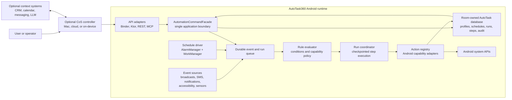

# AutoTask360 runtime architecture specification

Status: Proposed

This specification defines the maintainable product architecture for AutoTask360. It separates the Android automation runtime from any Chief-of-Staff (CoS) agent, Mac harness, language model, CRM, or context service.

## 1. Decision

AutoTask360 is an autonomous Android execution runtime. A CoS is an optional external controller that plans work, requests approval, invokes versioned commands, and observes results.

The Android runtime remains useful without a CoS. It owns event delivery, scheduling, matching, capability policy, action execution, persistence, recovery, and audit history.

The Mac harness, Codex, a cloud agent, and the on-device Rust brain are clients or optional context providers. They are not dependencies of the core automation engine and must not access its database or Android APIs directly.

## 2. Goals

- Provide one command boundary for the Android automation product.
- Execute multi-step automations reliably across process death, reboot, retries, and delayed steps.
- Keep Android-specific APIs at the platform boundary.
- Allow REST, MCP, UI, ContentProvider, and internal event sources to use the same behavior.
- Make profiles typed, versioned, validated, and safely evolvable.
- Support exact time triggers, flexible background schedules, and cron-like recurrence without a permanently running service.
- Make high-risk capabilities explicit, scoped, auditable, and user-controlled.
- Keep the runtime testable on the JVM wherever Android behavior is not required.

## 3. Non-goals

- Making the Mac CoS part of the Android product architecture.
- Building a general-purpose distributed workflow platform.
- Sharing a SQLite file between Android Room and the Rust brain.
- Allowing an LLM to execute Android APIs without passing through the command and policy boundaries.
- Replacing Android's permission, foreground-service, accessibility, alarm, or background-execution rules.

## 4. Target architecture



### 4.1 Component responsibilities

| Component | Owns | Must not own |
| --- | --- | --- |
| `AutomationCommandFacade` | Public application commands, validation, authorization, simulation, run requests | Transport details, direct Android API calls |
| Event ingress | Conversion of platform callbacks into normalized events | Rule matching or action execution |
| Schedule driver | Registering the next alarm or background work item | Profile semantics or action policy |
| Durable queue | Event and run state, deduplication, retry metadata | LLM planning |
| Rule evaluator | Trigger filters, conditions, cooldowns, profile selection | Android UI operations |
| Run coordinator | Ordered steps, timeout, retry, checkpoint, cancellation | Network protocol handling |
| Action registry | Action validation and execution adapters | Profile selection or CoS reasoning |
| Capability policy | Permission, special-access, consent, and risk decisions | Credential storage or transport authentication |
| Room database | Android automation state and audit history | Rust brain state |
| MCP and REST adapters | Protocol translation and response formatting | Repository or executor orchestration |
| CoS controller | Intent interpretation, planning, approvals, context lookup | Direct database or Android API access |

## 5. Application boundaries

The implementation should move toward these packages or Gradle modules. The first PRs may use packages inside `app`; module extraction can follow once the interfaces stabilize.

```text
:autotask-domain
  AutomationDefinition, Trigger, Condition, ActionStep
  EventEnvelope, ExecutionPolicy, RiskPolicy
  MatchResult, RunStatus, StepStatus

:autotask-runtime
  AutomationCommandFacade
  EventDispatcher, RuleEvaluator, RunCoordinator
  ScheduleManager, ActionRegistry

:autotask-data
  Room entities, DAOs, migrations, repositories

:autotask-android
  Broadcast and notification sources
  AlarmManager and WorkManager drivers
  Android action handlers
  Capability and consent providers
  Accessibility adapter

:autotask-api
  Ktor REST adapter
  MCP adapter
  Binder or ContentProvider adapter

:app
  Compose UI, lifecycle wiring, onboarding, diagnostics

:optional-context
  Rust brain IPC, CRM, WhatsApp, calendar, and other context integrations
```

The runtime should use an application-scoped dependency container instead of a global singleton with startup side effects. `AutoTaskEngine` can remain the migration facade while construction moves into explicit dependencies.

## 6. Core contracts

### 6.1 Automation definition

Persist a versioned definition and compile it on write:

```text
AutomationDefinition {
  id: String
  revision: Long
  schemaVersion: Int
  name: String
  description: String
  enabled: Boolean
  trigger: TriggerSpec
  conditions: List<ConditionSpec>
  steps: List<ActionStep>
  executionPolicy: ExecutionPolicy
  riskPolicy: RiskPolicy
}
```

The external representation may remain JSON, but it must be parsed into typed models at the command boundary. Invalid trigger types, action types, parameters, and incompatible capabilities must fail validation before persistence.

### 6.2 Event envelope

All event sources publish the same shape:

```text
EventEnvelope {
  eventId: String
  type: String
  source: String
  occurredAt: Instant
  receivedAt: Instant
  dedupeKey: String?
  correlationId: String
  payload: JsonObject
}
```

The event identifier and dedupe key support replay protection and idempotent handling. Event payloads should use a canonical JSON representation rather than `Map<String, Any?>` at public boundaries.

### 6.3 Run and step state

Every requested execution receives a `runId`. Each step is durable and observable. A run must support `cancel`, `retry`, `resume`, and `getStatus` without requiring the original caller to remain connected.

Long waits must persist a continuation and schedule a future wake-up. They must not hold a coroutine, foreground service, or process in memory for the duration of the wait.

## 7. Command API

The facade should expose these stable operations:

| Command | Purpose |
| --- | --- |
| `describeSchema` | Return supported triggers, actions, parameters, variables, and schema version. |
| `describeCapabilities` | Return current permissions, special access, device state, and policy gates. |
| `listAutomations` / `getAutomation` | Read definitions and revisions. |
| `validateAutomation` | Validate without persistence or execution. |
| `saveAutomation` / `patchAutomation` / `deleteAutomation` | Manage persistent definitions. |
| `simulate` | Return matching profiles, policy decisions, and planned steps without side effects. |
| `requestRun` | Enqueue a run and return `runId`; support idempotency keys. |
| `getRun` / `listRuns` | Observe aggregate and step state. |
| `cancelRun` / `retryRun` | Control durable runs. |

MCP tools and REST endpoints should map to these commands. MCP should not expose a second execution implementation.

The CoS workflow is:

1. Read schema and capabilities.
2. Validate the proposed automation.
3. Request simulation.
4. Ask the user for approval when policy requires it.
5. Save or update the automation.
6. Request a run with an idempotency key.
7. Observe the run and respond to failure or approval states.

## 8. Scheduling

Use the platform scheduler that matches the guarantee required:

- Use `AlarmManager` for exact user-visible times.
- Use `WorkManager` for durable, flexible background work.
- For cron-like recurrence, calculate and register only the next occurrence, then reschedule after delivery.
- Recalculate schedules after reboot, timezone changes, profile changes, and missed delivery.
- Treat scheduler delivery as an event ingress concern; the scheduler does not execute profiles directly.

The `SCHEDULE` schema must not claim cron support until schedule persistence, registration, delivery, timezone handling, and tests are implemented.

## 9. Persistence ownership

Android Room must exclusively own the AutoTask database, for example `autotask.db`. The Rust brain must exclusively own its own database, for example `cos.db`.

Before PR2, [AutoTaskDatabase](app/src/main/java/com/example/data/AutoTaskDatabase.kt) derived its path from `BrainService.dbPath`. PR2 moves Room to `databases/autotask.db`; the legacy importer reads the former shared file once and leaves Rust-owned `brain/cos.db` untouched.

Required AutoTask persistence:

- Automation definitions and revisions.
- Schedule registrations and next-fire times.
- Event envelopes or replay metadata.
- Runs and step runs.
- Approvals and policy decisions.
- Execution audit records.

The Android/Rust context bridge is process IPC, not database sharing. Context
requests and responses must use versioned RPC envelopes over the existing
brain client boundary. A bridge payload may contain a stable context ID,
schema version, correlation ID, timestamps, and explicitly requested fields;
it must not expose the Room file, Room handles, or unbounded table access to
the Rust process or an external CoS.

## 10. Security and lifecycle

Release behavior must follow these rules:

- Bind the Ktor server to loopback or keep it disabled by default.
- Use `adb forward` for development access from a Mac.
- Require explicit user pairing before LAN access.
- Use separate credentials for external clients and internal brain IPC.
- Scope credentials by operation: read, profile write, execute, UI control, and OTA.
- Require confirmation or a stored policy for high-risk operations such as SMS, calls, UI driving, arbitrary HTTP, file writes, and OTA.
- Mark services and providers non-exported unless external access is required, and protect required exported surfaces with signature-level permissions where possible.
- Disable cleartext network access in release builds unless a narrowly scoped exception is required.
- Never include bearer tokens, message bodies, contact exports, or full screen dumps in routine logs.

The foreground service should be an explicit connected-mode or exceptional-execution mechanism. Event delivery and scheduling should continue through Android-managed components whenever possible.

## 11. Pull-request plan

Each PR must remain buildable and independently reviewable.

### PR 1: Establish the command boundary

Implementation status: complete at the source level; build and contract gates remain pending until a Java 11+ runtime is available.

- Add `AutomationCommandFacade`.
- Move profile, schema, capability, simulation, run, and log operations behind the facade.
- Route REST, MCP, UI, ContentProvider, and event sources through the facade.
- Remove direct `repository` and `AutoTaskEngine` access from transport handlers.
- Preserve existing external behavior with compatibility adapters.

Tests: facade unit tests, REST contract tests, MCP contract tests, regression tests for ContentProvider and UI-triggered execution.

Gate: no transport layer contains profile matching or action execution logic.

### PR 2: Separate database ownership

Implementation status: complete at the source level; build, migration, and on-device startup gates remain pending until a Java 11+ runtime and Android test target are available.

- Give AutoTask Room its own database path.
- Keep the Rust brain database private to the Rust process.
- Import legacy Android-owned tables read-only from the former shared file; never delete or write that file from Room.
- Add database path and startup migration tests.
- Document the bridge contract for shared context data.

Tests: Room migration tests, process startup tests, database path tests, concurrent-open safety checks. The source-level path test asserts that Room and Rust resolve different files; the on-device concurrent-open check remains a release gate.

Gate: no two processes write the same database file.

### PR 3: Type and compile automation definitions

Implementation status: in progress at the source level. Typed definitions, compile-on-write, revision cache, and executor compile-on-read are in `app` packages. Build and contract gates remain pending until a Java 11+ runtime is available.

- Add schema-versioned typed definitions.
- Replace public `Map<String, Any?>` and raw JSON strings at command boundaries.
- Validate definitions on create and patch.
- Compile and cache definitions with revision-based invalidation.

Tests: valid and invalid schema fixtures, round-trip serialization, unknown-field handling, cache invalidation, backward compatibility.

Gate: malformed profiles cannot be persisted or reach the executor.

### PR 4: Add durable event and run execution

Implementation status: in progress at the source level. Event envelopes, durable runs/steps, dedupe/idempotency, checkpointed execution, cancel/retry/resume, and persisted WAIT continuations are in `app` packages.

- Add event envelopes, run records, and step records.
- Add bounded event dispatch and deduplication.
- Add checkpointed execution, timeout, retry, cancellation, and resume.
- Convert long waits into persisted continuations.

Tests: process-death recovery, retry behavior, cancellation, duplicate events, ordering, partial failure, and concurrent event load.

Gate: an interrupted run can resume or reach a terminal state without manual database repair.

### PR 5: Split the action registry

Implementation status: in progress at the source level. `ActionHandler` + `ActionRegistry` own execution, capability checks, timeout, and risk metadata. `ActionExecutor` is a compatibility coordinator.

- Define the action handler interface.
- Move device actions into capability-specific handlers.
- Centralize validation, required capabilities, timeout, and risk metadata.
- Keep `ActionExecutor` as a compatibility coordinator until all handlers migrate.

Tests: handler unit tests, capability-denied tests, Android instrumentation for privileged actions, timeout and cancellation tests.

Gate: adding an action does not require modifying a central action switch except for registration.

### PR 6: Implement the schedule manager

Implementation status: in progress at the source level. Schedule persistence, next-fire calculation, exact AlarmManager / flexible WorkManager drivers, and boot/timezone/missed-delivery reconciliation are in `app` packages. `SCHEDULE` now documents the supported 5-field cron grammar.

- Add schedule persistence and next-fire calculation.
- Implement exact alarms and flexible WorkManager delivery.
- Add boot, timezone, update, and missed-delivery reconciliation.
- Remove or correct the partial `SCHEDULE` claim until behavior is complete.

Tests: recurrence calculations, daylight-saving transitions, timezone changes, reboot rescheduling, duplicate alarm delivery, and Android scheduler integration.

Gate: every enabled schedule has an observable next-fire state and a tested recovery path.

### PR 7: Harden external control

Implementation status: in progress at the source level. Loopback is the default bind; LAN requires pairing. External `atc-` credentials are scoped and hashed; the internal `cos-` brain token is loopback-only. Rate limits, request size limits, idempotency keys, origin checks, redacted audit events, and remote high-risk approvals are in `app` packages.

- Default Ktor to loopback or disabled.
- Add pairing and scoped credentials.
- Separate internal brain IPC authentication.
- Add rate limits, request size limits, idempotency, and audit fields.
- Restrict high-risk commands by policy and approval state.

Tests: authorization matrix, replay and idempotency tests, malformed input tests, rate limiting, origin handling, and release-manifest checks.

Gate: an unauthenticated or under-scoped client cannot read or execute protected operations.

## 12. Implementation checklist

### Architecture

- [x] Define the domain interfaces before moving implementation code.
- [x] Introduce `AutomationCommandFacade`.
- [x] Route every caller through the facade.
- [x] Remove transport-specific orchestration.
- [x] Give Room and Rust independent database paths.
- [x] Add a read-only legacy database import path.
- [ ] Replace singleton startup side effects with explicit application wiring.
- [ ] Keep CoS, MCP, CRM, WhatsApp, and brain integrations outside the core runtime.

### Data and execution

- [x] Separate Room and Rust database ownership.
- [x] Add the first database migration path.
- [x] Add typed automation definitions.
- [x] Add compiled-definition caching.
- [x] Add event IDs, correlation IDs, and dedupe keys.
- [x] Add durable runs and step runs.
- [x] Add retry, timeout, cancellation, and resume semantics.
- [x] Add persisted continuations for long waits.

### Scheduling

- [x] Define exact-time versus flexible-work guarantees.
- [x] Implement schedule persistence.
- [x] Implement next-occurrence calculation.
- [x] Reconcile schedules after boot, timezone, and profile changes.
- [x] Add missed-delivery behavior.
- [x] Remove unsupported schedule claims from the schema.

### Security

- [x] Default the server to loopback or disabled.
- [x] Add explicit LAN pairing.
- [x] Separate external and internal credentials.
- [x] Add scoped authorization.
- [x] Add approval requirements for high-risk actions.
- [x] Restrict exported Android components.
- [x] Disable broad cleartext access in release builds.
- [x] Redact sensitive values from logs and audit payloads.

### Documentation and operations

- [ ] Document the command contract and versioning policy.
- [ ] Document the CoS integration sequence.
- [x] Document development access through `adb forward`.
- [x] Document release and LAN security modes.
- [ ] Add a troubleshooting guide for scheduler, permissions, and run recovery.

## 13. Test coverage plan

| Area | Required coverage | Preferred test type |
| --- | --- | --- |
| Domain models | Serialization, schema versions, equality, defaults | JVM unit tests |
| Matching | Trigger filters, conditions, cooldowns, priority, disabled profiles | JVM unit tests |
| Validation | Unknown actions, invalid parameters, malformed JSON, risk metadata | JVM unit tests |
| Command facade | Authorization, validation, simulation, idempotency, command results | JVM unit tests |
| MCP and REST | Tool schemas, request mapping, status codes, error shapes, compatibility | Contract tests |
| Persistence | Migrations, revisions, transactions, run state, database ownership | Room/integration tests |
| Event ingress | Normalization, dedupe, coalescing, correlation IDs | JVM and Android tests |
| Run coordinator | Ordering, retry, timeout, cancellation, resume, partial failure | JVM integration tests |
| Action handlers | Capability gates and handler behavior | JVM tests plus instrumentation |
| Scheduling | Next occurrence, timezone, DST, reboot, missed delivery | JVM plus Android integration |
| Security | Scope matrix, pairing, replay, request limits, redaction | Integration/security tests |
| Performance | Event throughput, queue latency, cold start, database contention | Benchmark tests |
| Device behavior | SMS, notification, accessibility, alarms, privileged settings | Physical-device smoke tests |

Minimum regression coverage before PR 1 merges:

- Existing unit tests pass.
- MCP tool schema tests pass.
- Facade tests cover create, patch, delete, simulate, run, and log retrieval.
- REST and MCP return equivalent results for equivalent commands.
- Invalid profiles are rejected before persistence.

## 14. Gates

### Pull-request gates

- [ ] `./gradlew testDebugUnitTest` passes.
- [ ] Relevant instrumentation tests pass on the supported Android test device or emulator.
- [ ] `./gradlew lint` passes with no new high-severity findings.
- [ ] `git diff --check` passes.
- [ ] No PR introduces direct transport-to-repository execution paths.
- [ ] No PR introduces a second source of truth for profile or run state.
- [x] New actions include validation, capability metadata, policy behavior, and tests.
- [ ] New public command behavior is documented and versioned.

### Release gates

- [ ] Database migrations are tested from the previous released schema.
- [ ] A killed process can recover queued and running work.
- [ ] Reboot and timezone changes preserve enabled schedules.
- [ ] High-risk actions require the expected permission and approval state.
- [ ] Release builds do not expose an unauthenticated LAN server.
- [ ] Release builds do not share a database file with the Rust brain.
- [ ] Sensitive request and execution data is redacted from logs.
- [ ] Physical-device smoke tests pass for the supported capability set.

### Operational gates

- [ ] Every run has a queryable `runId`.
- [ ] Every terminal run has an audit record.
- [ ] Queue depth, oldest event age, failed runs, and scheduler drift are observable.
- [ ] Capability failures explain the missing grant or approval.
- [ ] Retry behavior is bounded and visible.
- [ ] The CoS can distinguish validation failure, approval required, execution failure, and unavailable capability.

## 15. Acceptance criteria

This architecture is considered implemented when:

1. A client can create, validate, simulate, execute, cancel, and inspect an automation through the command facade.
2. REST and MCP are thin adapters over the same facade.
3. The Android runtime executes without a Mac harness, Rust brain, or LLM process.
4. A process interruption does not silently lose a durable run.
5. The scheduler survives reboot and timezone changes.
6. Room and the Rust brain have independent database ownership.
7. High-risk actions are blocked without the required capability and approval.
8. The test and release gates in this document pass.

## 16. Open decisions before execution

- [x] Select Kotlin serialization or another canonical typed representation. PR 3 uses typed Kotlin data classes plus an explicit JSON codec in `com.example.domain`; Moshi remains available for HTTP clients, and module extraction is deferred until the command contracts stabilize.
- [x] Decide whether the first implementation remains in `app` packages or extracts Gradle modules immediately.
- [x] Define the supported cron grammar and timezone semantics. PR 6 uses 5-field cron (`minute hour day-of-month month day-of-week`) with `*`, lists, ranges, and steps; optional IANA `timezone` on TIME/SCHEDULE/SUNRISE_SUNSET (device zone by default). DST gaps skip to the next valid local time; overlaps use the first occurrence.
- [x] Define the approval model for high-risk actions. PR 7 requires paired remote clients to present stored `approvedActions` for `confirm_required` or elevated-risk types (SMS, call, UI drive, HTTP, file write, camera). Missing approvals return `APPROVAL_REQUIRED` and do not execute. On-device and internal-brain callers are unchanged.
- [ ] Define retention limits for events, runs, and execution logs.
- [x] Define the external pairing and credential-rotation flow. PR 7: loopback `POST /v1/pairing/start` issues a 6-digit code; `complete` returns an `atc-` token once and stores only the SHA-256 hash plus scopes. LAN bind is off until a live credential exists. Revoke invalidates the hash. The `cos-` brain token never authorizes LAN.
- [ ] Decide which context data, if any, crosses the Android/Rust brain boundary.
